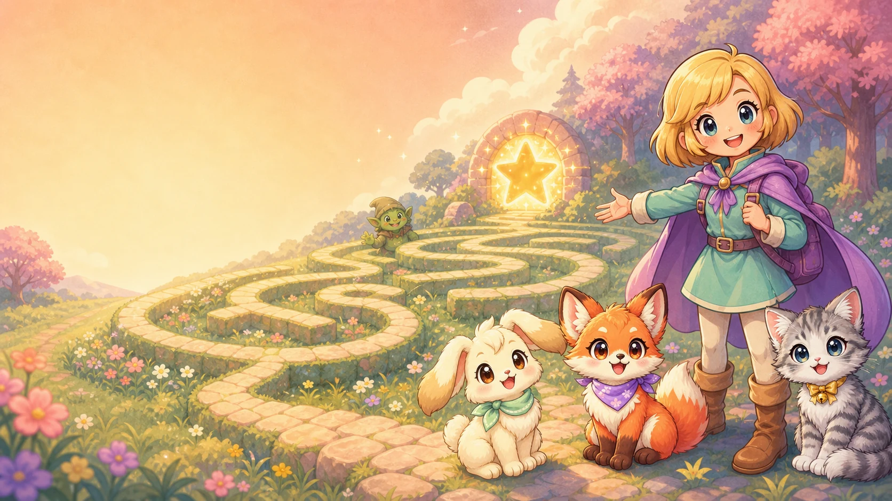
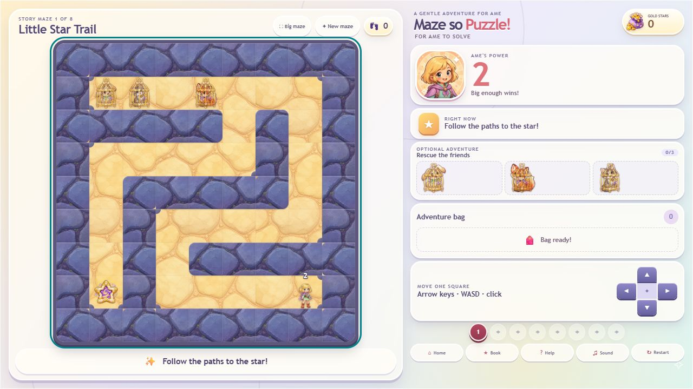

# Maze so Puzzle: For Ame to Solve!

[](https://github.com/MachineKomi/maze-so-puzzle/actions/workflows/ci.yml)



A gentle, browser-first fantasy maze game for young players, with an optional
Windows desktop build powered by Tauri 2. This README describes the playable
0.17.0 play-test build, which remains an active prototype. Its complete
automated browser gate and refreshed unsigned Windows packaging are verified.
The verified source is live on the canonical Vercel site; the broader
physical-device play-test pass remains a release step.



## Requirements

- Node.js `^20.19.0` or `>=22.12.0` and npm.
- Rust 1.77.2 or newer plus the Windows Tauri prerequisites for desktop builds.
- Microsoft Edge WebView2 for the Windows executable.

## Play the browser build

The current public build is available at
[maze-so-puzzle.vercel.app](https://maze-so-puzzle.vercel.app/).

```powershell
npm ci
npm run dev
```

Open <http://127.0.0.1:1420>. Progress is stored locally in that browser profile.

Production browser build:

```powershell
npm run build
npm run preview
```

## Deploy the browser game

The GitHub repository is connected to the zero-backend Vercel Hobby project at
[maze-so-puzzle.vercel.app](https://maze-so-puzzle.vercel.app/). A push to
`main` automatically builds and promotes the new production deployment; other
branches can receive preview deployments. The committed settings select Vite,
`npm ci`, `npm run build`, and `dist` with no environment variables or paid
services. See the [Vercel deployment guide](docs/VERCEL_DEPLOYMENT.md).

## Play or build the Windows app

Run the desktop development build:

```powershell
npm run desktop:dev
```

Build the standalone executable and NSIS installer:

```powershell
npm run desktop:build
```

The current verified desktop artifacts are the unsigned 0.17.0 test build:

- Portable test copy: `release/Maze-so-Puzzle-0.17.0-portable.exe`
  (97,084,416 bytes; SHA-256
  `6BA5646F19190D508A72F9E1D4B6B6F464E1141C279EE0575F7218282779A7FD`).
- NSIS installer test copy: `release/Maze-so-Puzzle-0.17.0-setup.exe`
  (90,987,042 bytes; SHA-256
  `723B21F355BA941BE10B3EC180ABBB639C111780EC389BE45C47AFB8386E7F9D`).
  Executables are deliberately
  excluded from source history and should be attached to a GitHub Release.
- Original standalone build output: `src-tauri/target/release/maze-so-puzzle.exe`
  (this mutable path byte-matches the staged portable copy).
- Original installer output: `src-tauri/target/release/bundle/nsis/Maze so
  Puzzle - For Ame to Solve!_0.17.0_x64-setup.exe` (byte-matches the staged
  setup copy).
- Both executables report file/product version 0.17.0. The portable app remained
  responsive for a five-second smoke launch and showed the correct game title.
- The verified 0.17.0 hashes and retained archive hashes are recorded in
  [`release/SHA256SUMS.txt`](release/SHA256SUMS.txt). Executable test builds stay
  out of Git history and can be published separately as GitHub Release assets.

## Controls

- Arrow keys or `WASD`: move one square.
- Press the primary mouse button or touch the maze to move one square toward the
  pointer. Keep holding for continuous grid movement, or drag to steer; Ame
  recalculates the direction as the pointer moves and stops on release or when
  the pointer returns to her dead zone.
- Movement has a deliberately small one-tile corner assist when the intended
  square is a wall. A clear pointer offset or Ame's approach direction chooses
  the safe perpendicular floor tile, with a little touch-wobble tolerance. It
  never follows a wall, pathfinds, enters a hazard or hole, or routes around a
  door or enemy.
- On-screen arrows: touch- and mouse-friendly movement.
- Holding touch, mouse, keyboard, or an on-screen arrow moves once immediately,
  waits 320 ms so a child can release after one square, then accelerates
  smoothly from 260 ms to a capped 160 ms repeat over 16 held steps. Changing
  direction resets the acceleration, and a 120 ms visual ease keeps each grid
  step readable.
- The complete interface uses a fixed 960 × 540 logical canvas and scales
  uniformly into the device safe area. Desktop and iPad keep the same relative
  composition; extra-wide phones letterbox instead of stretching or rearranging
  cards. Touch play prevents page panning and pinch-zoom.
- Big Maze: enlarge the board while keeping a compact Power, rescue, and item
  HUD; press `Escape` or Normal to return to the full side panel.
- Any maze wider or taller than 6 tiles uses a player-centred 6 x 6 exploration
  view. Its minimap reveals the current view immediately and remembers every
  square Ame has already explored while keeping the rest hidden.

## Tester preview mode

On the title screen, click or tap the small **Playable build 0.17.0** label to
open the secret tester maze picker. The same picker opens automatically when the
exact query `?debug=mazes` is appended to the game URL. It gives direct access to
every authored maze, including locked ones, and labels each maze's dimensions
and camera mode. Runs entered through the picker are previews: completion
rewards, records, unlocks, active-run recovery, and saved progress are not
changed.

## Install on an iPad

Open the production URL in Safari, tap **Share**, choose **More**, then
**Add to Home Screen**. Enable **Open as Web App** and tap **Add**. The installed
icon uses the bundled Ame artwork and opens without Safari's normal tab chrome.
Turn the iPad sideways to play.

## Included in playable build 0.17.0

- The Adventure Book now has fifteen distinct rendered keepsakes: three
  stickers, three rescue medals, and nine embroidered achievement patches.
  Newly earned badges use their real art in the victory screen and recent
  keepsakes appear in Ame's in-maze collection strip.
- Functional emoji placeholders across the title, Book, help, hints, compact
  HUD, feedback toasts, locks, and completion notices have been replaced with
  the game's own illustrated sprites. The new transparent assets ship as crisp
  512 × 512 lossless WebP and Book cards decode lazily.

- The gentle soundtrack now begins on the home screen after the browser's first
  permitted tap, click, or key press. Maze changes draw from a thirteen-song
  shuffle bag: every full track plays before the cycle repeats, and the same
  song never plays twice in a row.

- Four new rescue friends bring the catalogue to 15 species: Chinchilla,
  Alpaca, Penguin, and Koala. Each friend now carries a species personality into
  cage, following, rescue, victory-dance, and Adventure Book presentations.
- Cloud Gremlin, Pumpkin Sprite, Clockwork Crab, and Jelly Sorcerer expand the
  playful enemy cast to 12 looks, with distinct idle motion and magical
  flourishes rather than extra per-frame image downloads.
- Pearl Grotto and Harvest Bramble add two coordinated terrain families and
  sparse crystal or autumn dressing. All 12 compatible themes appear in the
  authored campaign, alongside every friend and enemy style.
- Large mazes now mount only camera-visible object sprites during exploration.
  The Adventure Book lazily decodes portraits below its first shelf, keeping the
  opening download focused while the full-resolution art stays crisp on demand.

- Spring Boots puzzles now vary between one, two, and three consecutive holes.
  Longer jumps receive longer, higher arcs, with an extra mid-air boing on the
  three-hole leap.
- Lanternlight Labyrinth includes a four-way junction hole: one movement input
  always jumps straight to the opposite landing, so the centre controls both
  directions without turning or pathfinding mid-air.
- The visual catalogue adds Otter, Lamb, and Capybara friends; Acorn Knight,
  Bubble Dragon, and Candy Mimic enemies; plus Comet Spear, Bubble Bow, and
  Cupcake Mace weapons.

- A hard 24×24 maximum for every maze. Procedural topology stays on readable odd
  sizes from 9×9 through 23×23, and authored levels are validated by the same
  limit.
- Later Surprise Mazes now carve compact 2×2 through 4×4 rooms, with clustered
  friends and treasure, monster rooms, and strong guardians that encourage
  exploring elsewhere and returning with more Power.
- Lanternlight Labyrinth is now a denser 23×23 room puzzle rather than a 25×25
  corridor marathon. Its main chamber combines two rescues, two treasures, and
  a Power 10 guardian.
- The Adventure Book now explains that Surprise Mazes are procedurally generated
  rather than a hidden fixed catalogue, remembers recent completion records,
  and offers a direct fresh-maze button.

- A complete sixteen-chapter **Puzzlewild** story arc turns the authored campaign
  into a gentle fantasy JRPG read-together adventure. Sprig the baby
  cloud-dragon's Great Glittery Hiccup tangled the Star Map, and Ame becomes a
  Junior Pathkeeper with help from Professor Poggle, an owl cartographer who
  frequently reads maps upside down.
- Each story maze opens with one self-contained illustrated chapter card,
  character dialogue, one real “Puzzle power,” and a simple optional
  conversation prompt. One tap anywhere or any ordinary key skips the entire
  card and starts play; Tab and modifier shortcuts remain available.
- A picture-led Story control can reopen the chapter during play. Victory
  screens include a short epilogue, Maze Select and the Adventure Book show the
  thinking skill for each chapter, and resumed/tester runs never force an intro.
- New original AI-generated portraits introduce Professor Poggle and Sprig in
  the existing polished chunky fantasy-JRPG art direction.

- Rewarding exploration: optional Golden Star bags and overflowing treasure
  chests, plus gears and magical beakers worth Science Points, populate dead
  ends. Pickups burst into stars or science sparkles and fly to two persistent
  currency counters.
- Contextual obstacle help shows the exact missing key or equipment. Repeating
  the same blocked action three times marks that prerequisite with a pulsing
  minimap beacon until Ame collects it.
- A picture-led **Mazes** menu is available from Home and during play. It lists
  every unlocked numbered story maze, its best steps and rescue record, plus
  Surprise Maze, while the secret tester picker still exposes all authored
  chapters.
- Sixteen story mazes now culminate in **Rainbow Power Parade**, a long
  out-and-back Power-growth puzzle with nineteen enemies, five friends, a
  Power-99 boss gate, and a rainbow aura for Ame at Power 99 or above.
- Every maze chooses a directional light. Wall highlights, directional depth
  shadows, and soft offset character shadows give the flat tile art more depth
  without sacrificing readability.
- The sidebar dedicates more space to the minimap, rescue friends and inventory;
  the bottom navigation uses six original transparent picture icons instead of
  emoji glyphs.

- One stable 16:9 visual system for title, play, Adventure Book, tester picker,
  dialogs, and victory celebrations. Its tested scaling contract covers desktop,
  classic and modern iPads, and landscape phones down to 568 × 320 without
  document overflow or panel intersections.
- Count-aware victory friend cards keep rescued pets large and dancing on iPad
  and desktop. One to three friends receive roomy centred cards; groups of four
  or five remain together in a readable row.
- Sixteen progressive story mazes with deliberate changes of pace. Sizes vary
  from 9 × 9 to 23 × 23 rather than rising monotonically. The 21 × 21
  **Twilight Treasure Loop** and 23 × 23 **Moonlit Friendship Quest** add long
  backtracking puzzles after Lanternlight Labyrinth; the latter introduces the
  Antidote Leaf and a required connected poison crossing. Three new portal
  chapters finish the current campaign with deliberately deceptive loops,
  return trips, optional rescue wings, and a five-friend final vault.
- Three paired flower portals—Rose Heart, Mint Clover, and Violet Moon—warp Ame
  between distant parts of the same maze. Portal pairs are visible on the board
  and minimap, preserve fog-of-war, active-run saving, follower trails, and
  solver correctness, and use original transparent AI-generated sprite art.
- A consistent player-centred 6 x 6 camera for every maze whose width or height
  exceeds 6 tiles, including all current story and Surprise Mazes. A persistent
  fog-of-war minimap distinguishes Ame's current view, explored passages, and
  still-mysterious parts of the maze; a bright outline links it to the exact
  area shown on the main board.
- Fresh, solver-validated Surprise Mazes whose seed varies the readable odd
  topology size across unlocked bands from 9 x 9 through 23 x 23. Later play
  unlocks variety rather than forcing every new maze to be larger, and the hard
  presentation ceiling is 24. Each seed also selects its illustrated terrain,
  weapon, friendly enemy, and cage variants deterministically.
- A typed floor-and-wall theme catalogue with dominant-colour metadata and an
  explicit compatibility matrix, plus eight weapon looks, eight friendly enemy
  looks, eleven pet species, and four cage styles. Story and generated mazes use
  only compatible pastel material pairs—yellow/gold floors are never combined
  with green or sage walls. Every maze contains one weapon; rescue parties now
  vary from one or two friends in the opening mazes to four and five in the
  largest late adventures.
- A new illustrated title screen, backed by original AI-generated key art, with
  Continue, Adventure Book, and Surprise Maze shortcuts.
- An Adventure Book showing story-maze clears, best step counts, rescue records,
  cumulative totals for all eleven pet species, gold, completion statistics,
  stickers, rescue medals, and nine stat-driven achievement badges.
- Persistent gold rewards, three collectible stickers, best results, and rescue
  medals for 5, 10, and 15 perfect rescues using each maze's actual friend total.
- Weapon-gated friendly enemy encounters and visible Power numbers. Later
  authored layouts deliberately place weapons, keys, boots, potions, weaker
  enemies, and optional guardians on different branches, so progress requires
  readable detours and backtracking instead of placing every answer along one
  forward path. Wishing Woods retains its optional Power 9 pebble-golem rescue
  puzzle, and the four latest challenge mazes have solver-verified out-and-back
  routes.
- Ame visibly holds the level's collected weapon. Her maze sprite and the
  friendly enemies are larger, and their larger outlined Power numbers sit
  above the character art without covering faces. Jump and battle copies retain
  the same readable scale.
- Power growth from defeated lower-level enemies and `+2` potions.
- Three dedicated colour-and-shape lock pairs: a pink **Rose Heart Key** and
  Rose Heart Door, blue **Blue Star Key** and Blue Star Door, and yellow
  **Sunny Sun Key** and Sunny Sun Door. The art, names, hints, and accessible
  descriptions all share the same typed pair metadata.
- Protective splash boots for water and warm magical lava, illustrated Spring
  Boots for jumping over one or more consecutive ground holes, and a magical
  Antidote Leaf for crossing soft purple poison. One
  directional input performs the whole safe jump and can land only on a valid
  non-hole square; holes never become ordinary walkable floor.
- Authored hazards form connected pools and patches of at least two tiles;
  generated growing/adventure mazes create deterministic connected 2–4 tile
  water or lava regions only after the boots gate, while preserving both the
  ordinary and perfect-rescue solutions.
- Child-safe strong-enemy blocking: an underpowered collision leaves the exact
  same playing state intact and offers one clear “I'll go get stronger” action;
  there is no maze reset or accidental defeat. Saved progress and active-run
  snapshots migrate defensively, with a pictorial help card, state-aware hints,
  mute control, and reduced-motion support.
- A separately validated active-run snapshot lets authored story mazes resume at
  the exact position, inventory, Power, step count, rescue state, and explored
  map after a refresh or app restart. Tester and generated runs are excluded.
- Expanded synthesized sound design for movement and interactions plus title,
  menu, selection, achievement, stamp, rescue, jump, combat clash, sparks,
  impact, Power count-up, loss, and victory moments. Thirteen full locally
  bundled tracks run through a deterministic session shuffle on every maze
  change, using every song before repeating and never repeating immediately.
  The home screen plays its gentle theme after the first permitted gesture; the
  short friendship cue remains reserved as a non-looping event sting. Spring
  Boots have a crisp four-layer synthesized boing, while every combat contact
  receives its own clash, sparks, and impact cue.
- Short, input-locking combat and rescue presentations make important moments
  readable without changing engine rules. A winning battle now has three cute
  bashes: the enemy's visible Power drains stepwise to `0` while the exact same
  amount counts into Ame, with glowing Power motes and a final victory burst.
  The engine resolves that battle without moving Ame or adding a step: the foe
  clears while she stays one square away, and the next input enters that square.
  Rescued friends pop free, hop excitedly, and then join the follower trail.
  Reduced-motion mode collapses these flourishes to a brief exact handoff.
- Spring Boots crossings show a clear 540 ms take-off, high hop, moving ground
  shadow, landing squash, and boing. The hop plays before a rescue or battle if
  Ame lands directly on an interactive tile, and completion waits for the full
  set piece before opening.
- Continuous SVG terrain rendered in global maze coordinates, so textures do
  not restart or reveal a border at every grid square. The AI-generated paired
  floor and wall materials use seam-suppressing periodic correction and a
  smaller readable scale; selected garden, woodland, and ruin themes add sparse
  transparent flower, moss, and ivy dressing. Periodic water, lava, and poison
  textures join into connected regions. Exact convex and concave wall curves
  follow bends cleanly. Hazards use a slightly inset, softly feathered rounded
  silhouette with no outline, lip, raised edge, or cast shadow. Per-theme
  brightness, saturation, and contrast treatment keeps walls readable without
  crushing naturally dark masonry.
- A cleaner picture-first sidebar with larger rescue friends, cages, enemy and
  inventory variants, no overlapping completion ticks, clearer found/missing
  silhouettes, and the selected weapon overlaid in Ame's hands. The old
  tile-sized move arrow/cross overlay is removed.
- A short board-centred picture-and-name toast celebrates each important pickup:
  the maze weapon, splash boots, Spring Boots, Antidote Leaf, potion, and the
  current lock-pair key. It runs independently from the compact feedback bar and
  becomes a static notice when reduced motion is preferred.
- Rescued friends leave their cages and follow Ame along her recent visible
  footsteps. Four new sparse v4 front-only cage overlays use a low base, two
  side posts, and exactly three narrow bars. Their visible pieces stay opaque
  and crisp while at least 70% of the centre remains open for the animal art.
- A landscape presentation with a friendly turn-sideways screen on portrait
  devices. Phones fill their safe landscape viewport; iPad and phone boards use
  a full-height play card with compact, overlaid maze information.
- Unified primary-pointer controls for mouse and touch, a floating touch cursor,
  no-pinch installed-app metadata, and safer overscroll/selection handling for
  iPad and Android play.
- Safe session navigation: a maze can be resumed after visiting Home, the
  Adventure Book, refreshing the page, or reopening the app; changing maze
  mid-run asks for confirmation.
- A confirmed **Reset progress** action on both the title screen and Adventure
  Book forgets Maze so Puzzle records, gold, rescues, stickers, medals, badges,
  and the active maze, then returns to Story Maze 1. It removes only the game's
  explicit current, v2, legacy, and active-run storage keys.

## Solvability and game rules

The core engine is immutable and UI-independent. Generated and curated levels
are checked with a stateful breadth-first solver that tracks position, Power,
weapon, splash boots, Spring Boots, keys, rescued animals, collected pickups,
defeated enemies, and opened doors. Hole jumps use the same transition function
as real play. Geometric reachability alone is never treated as proof that a
level is solvable.

Combat uses one child-friendly rule: Ame wins when her Power is **at least** the
enemy's Power. Winning adds the enemy's number to Ame's Power. A stronger enemy
refuses the move, preserves the exact same playing state, and shows an
encouraging comparison so Ame can explore, grow stronger, and return.

Core engine modules live in `src/game/`; UI input helpers live in `src/`:

- `engine.ts`: movement and interactions.
- `levels.ts`: the sixteen authored story levels.
- `exploration.ts`: clamped camera windows, field-of-view tiles, and persistent
  minimap reveal state.
- `followerTrail.ts`: bounded, loop-free recent footsteps for visible rescued-pet
  followers.
- `terrainGeometry.ts`: connected rounded SVG boundaries in stable maze/world
  coordinates for walls, water, lava, and poison.
- `solver.ts`: structural validation and stateful solution search.
- `generator.ts`: seeded perfect-maze generation and progression placement.
- `pointerControls.ts`: tile-relative pointer intent and the strict one-tile,
  wall-only corner-assist rule.
- `movementControls.ts`: the shared held-input acceleration curve and cadence
  state used by touch, mouse, keyboard/WASD, and on-screen arrows.

## Verification

```powershell
npm run check
npm audit
npm run check:desktop
```

`npm run check` runs the complete unit suite followed by the strict TypeScript
and Vite production build. The suite covers movement, interactions, solvability,
generation, animal rescues, camera and fog-of-war rules, progress migration,
rewards, statistics, achievements, protected navigation, deterministic visual
variants, the optional guardian route, and audio safeguards.
The 0.17.0 source suite passes 312 automated tests across 25 files and the strict
TypeScript/Vite production build. Coverage includes Spring Boots and single- or
multi-hole jumps, unsafe landing rejection, legacy active-run migration,
prerequisite detours, all sixteen authored ordinary/perfect-rescue routes,
dominant-colour theme compatibility, thirteen-track per-maze music selection, the
6 x 6 even camera, variable 9–23 room-aware generation, solver-safe connected hazards,
pointer intent/corner assistance, the slower eased held-input cadence, variable
1–5 friend totals, immutable strong-enemy warnings, poison/antidote traversal
and migration, theme lightness and colour compatibility, transparent terrain
dressing, rescued-pet trails, persistent minimap reveal, dedicated Rose Heart,
Blue Star, and Sunny Sun lock artwork, sparse v4 cage fronts, stationary winning
combat, paired-portal structural validation and travel, portal-safe active-run
recovery, full-world camera interpolation, scaled-pointer hysteresis, and the
full-reset storage allow-list, complete friend/enemy personality maps, scoped
large-maze object mounting, and below-fold portrait lazy loading.

The 0.17.0 Tauri portable executable and NSIS installer byte-match their final
build outputs, report file/product version 0.17.0, and are size-checked and
SHA-256 hashed. The portable app also passed a responsive five-second launch
smoke with the correct title. Clean-machine installation, signing, and
physical-device checks remain separate release gates. The release source is
pushed to GitHub `main`, whose connected Vercel project deploys the canonical
site automatically.

The browser matrix, remaining release gates, and Windows artifact
record are kept in
[`docs/RELEASE_CHECKLIST.md`](docs/RELEASE_CHECKLIST.md). Rebuild the Windows
package after any later source or version change with:

```powershell
npm run desktop:build
```

The current 0.17.0 Windows test installer is unsigned, so Windows SmartScreen
may show a warning. Any future broadly distributed Windows release should be
code-signed.

## Project documentation

- [Architecture and extension points](docs/ARCHITECTURE.md)
- [Puzzlewild story bible and educational progression](docs/STORY_BIBLE.md)
- [Soundtrack catalogue and playback policy](docs/MUSIC.md)
- [Vercel deployment guide](docs/VERCEL_DEPLOYMENT.md)
- [Privacy and saved-data notes](docs/PRIVACY.md)
- [AI asset provenance and prompts](docs/AI_ASSET_PROMPTS.md)
- [Project audit and prioritized backlog](docs/PROJECT_AUDIT.md)
- [Release checklist](docs/RELEASE_CHECKLIST.md)
- [Player-visible changelog](CHANGELOG.md)
- [Windows test-build notes](release/README.md)

## Licensing

No source-code or asset licence has been selected yet. Publishing this repository
does not grant permission to copy, redistribute, or reuse its code or artwork;
copyright remains with the project owner until an explicit licence is added.
