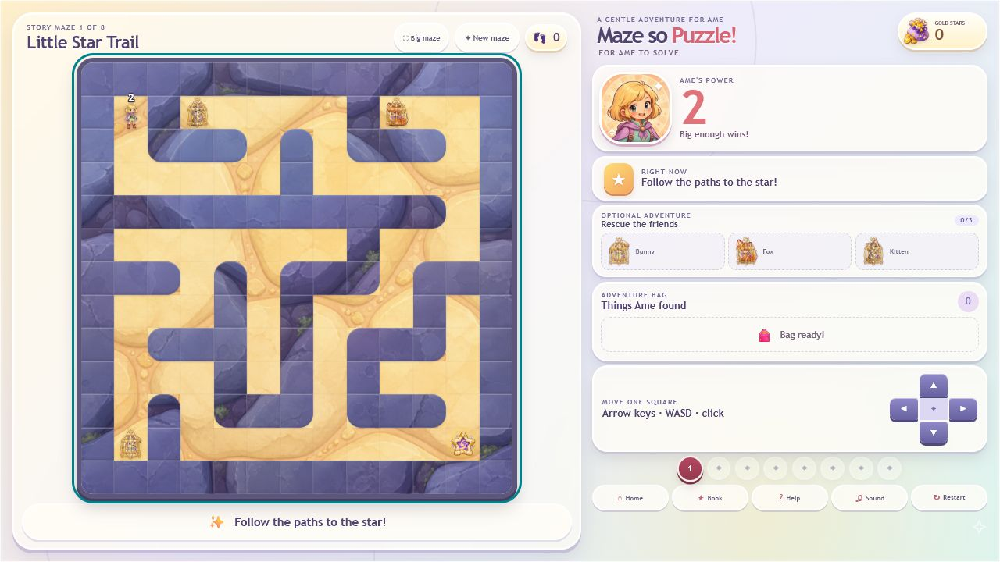

# Maze so Puzzle: For Ame to Solve!

[](https://github.com/MachineKomi/maze-so-puzzle/actions/workflows/ci.yml)


A gentle, browser-first fantasy maze game for young players, with an optional
Windows desktop build powered by Tauri 2. This README describes playable build
0.3.0, which is still an active play-test prototype.



## Requirements

- Node.js `^20.19.0` or `>=22.12.0` and npm.
- Rust 1.77.2 or newer plus the Windows Tauri prerequisites for desktop builds.
- Microsoft Edge WebView2 for the Windows executable.

## Play the browser build

```powershell
npm ci
npm run dev
```

Open <http://127.0.0.1:1420>. Progress is stored locally in that browser profile.

Production browser build:

```powershell
npm run build
npm run preview
```

## Deploy the browser game

The project includes a zero-backend Vercel configuration for a static Hobby-plan
deployment. Import `MachineKomi/maze-so-puzzle` from the Vercel dashboard; the
committed settings select Vite, `npm ci`, `npm run build`, and `dist` with no
environment variables or paid services. See the
[Vercel deployment guide](docs/VERCEL_DEPLOYMENT.md).

## Play or build the Windows app

Run the desktop development build:

```powershell
npm run desktop:dev
```

Build the standalone executable and NSIS installer:

```powershell
npm run desktop:build
```

Verified local outputs from the 0.3.0 desktop build and release-copy step:

- Easy-to-find local test copies: `release/Maze-so-Puzzle-0.3.0-portable.exe`
  and `release/Maze-so-Puzzle-0.3.0-setup.exe`. Executables are deliberately
  excluded from source history and should be attached to a GitHub Release.
- Standalone app: `src-tauri/target/release/maze-so-puzzle.exe`.
- Installer: `src-tauri/target/release/bundle/nsis/Maze so Puzzle - For Ame to
  Solve!_0.3.0_x64-setup.exe`.
- The verified 0.3.0 hashes are recorded in
  [`release/SHA256SUMS.txt`](release/SHA256SUMS.txt). Executable test builds stay
  out of Git history and can be published separately as GitHub Release assets.

## Controls

- Arrow keys or `WASD`: move one square.
- Click or tap anywhere on the maze: move one square in the dominant direction
  from Ame. There is deliberately no destination pathfinding.
- On-screen arrows: touch- and mouse-friendly movement.
- Big Maze: enlarge the board while keeping a compact Power, rescue, and item
  HUD; press `Escape` or Normal to return to the full side panel.

## Included in playable build 0.3.0

- Eight progressive story mazes sized from 13 x 13 through 23 x 23, with gentle
  one-mechanic-at-a-time onboarding before later levels combine the full toybox.
- Fresh, solver-validated 13 x 13 through 23 x 23 surprise mazes from the
  deterministic "New maze" generator.
- Three optional animal friends to rescue in every maze: a bunny, fox, and kitten.
- A new illustrated title screen, backed by original AI-generated key art, with
  Continue, Adventure Book, and Surprise Maze shortcuts.
- An Adventure Book showing story-maze clears, best step counts, rescue records,
  cumulative bunny/fox/kitten totals, gold, completion statistics, stickers,
  rescue medals, and nine stat-driven achievement badges.
- Persistent gold rewards, three collectible stickers, best results, and rescue
  medals for 5, 10, and 15 perfect three-animal rescues.
- Sword-gated goblin encounters and visible Power numbers.
- Power growth from defeated lower-level goblins and `+2` potions.
- Colour-coded star keys and matching doors.
- Protective boots for water and warm magical lava.
- Exact level reset after a loss, schema-v3 saved progress with defensive v1/v2
  migration, a pictorial help card, mute control, and reduced-motion support.
- Expanded synthesized sound design for movement and interactions plus title,
  menu, selection, achievement, stamp, rescue, loss, and victory moments.
- Upgraded v2 AI-generated art, including Ame, animal friends, goblins, items,
  doors, goals, UI decoration, and seamless floor, stone wall, water, and lava
  treatments.
- A 16:9 landscape presentation with a friendly turn-sideways screen on portrait
  devices.
- Safe session navigation: a maze can be resumed after visiting Home or the
  Adventure Book, and changing maze mid-run asks for confirmation.

## Solvability and game rules

The core engine is immutable and UI-independent. Generated and curated levels
are checked with a stateful breadth-first solver that tracks position, Power,
sword, boots, keys, rescued animals, collected pickups, defeated goblins, and
opened doors. Geometric reachability alone is never treated as proof that a
level is solvable.

Combat uses one child-friendly rule: Ame wins when her Power is **at least** the
goblin's Power. Winning adds the goblin's number to Ame's Power. A stronger
goblin triggers a low-stakes retry screen and restores the same level state.

Core modules live in `src/game/`:

- `engine.ts`: movement and interactions.
- `levels.ts`: the eight authored story levels.
- `solver.ts`: structural validation and stateful solution search.
- `generator.ts`: seeded perfect-maze generation and progression placement.

## Verification

```powershell
npm run check
npm audit
npm run check:desktop
npm run desktop:build
```

`npm run check` runs the complete unit suite followed by the strict TypeScript
and Vite production build. The current suite contains 79 tests covering
movement, interactions, solvability, generation, animal rescues, progress
migration, rewards, statistics, achievements, protected navigation, and audio
safeguards. The final local run passed all 79 tests, strict TypeScript/Vite,
locked Cargo compilation, dependency audit, production-browser smoke tests, and
Tauri packaging. The portable executable also remained responsive in a smoke
launch. Clean-machine installer, signing, and full manual play-through checks
remain in the release checklist.

The required manual browser and Windows test matrix is maintained in
[`docs/RELEASE_CHECKLIST.md`](docs/RELEASE_CHECKLIST.md); run it again against
the exact artifacts that will be shared. The Windows test installer is unsigned,
so Windows SmartScreen may show a warning. A public release should be code-signed.

## Project documentation

- [Architecture and extension points](docs/ARCHITECTURE.md)
- [Vercel deployment guide](docs/VERCEL_DEPLOYMENT.md)
- [Privacy and saved-data notes](docs/PRIVACY.md)
- [AI asset provenance and prompts](docs/AI_ASSET_PROMPTS.md)
- [Project audit and prioritized backlog](docs/PROJECT_AUDIT.md)
- [Release checklist](docs/RELEASE_CHECKLIST.md)
- [Player-visible changelog](CHANGELOG.md)
- [Windows test-build notes](release/README.md)

## Licensing

No source-code or asset licence has been selected yet. Publishing this repository
does not grant permission to copy, redistribute, or reuse its code or artwork;
copyright remains with the project owner until an explicit licence is added.
