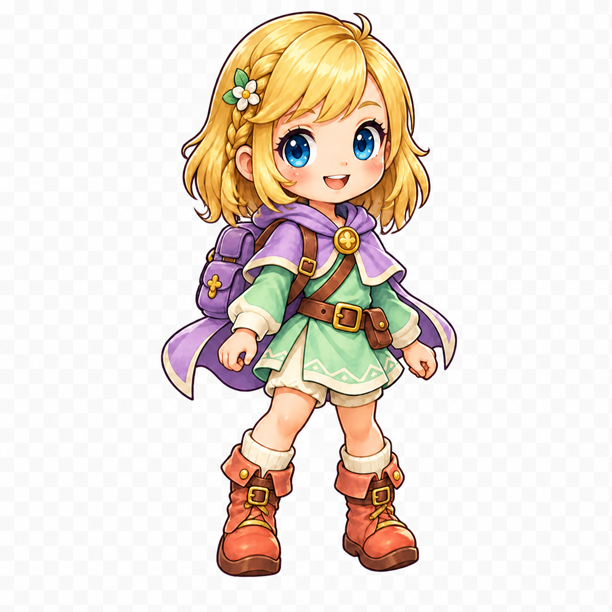
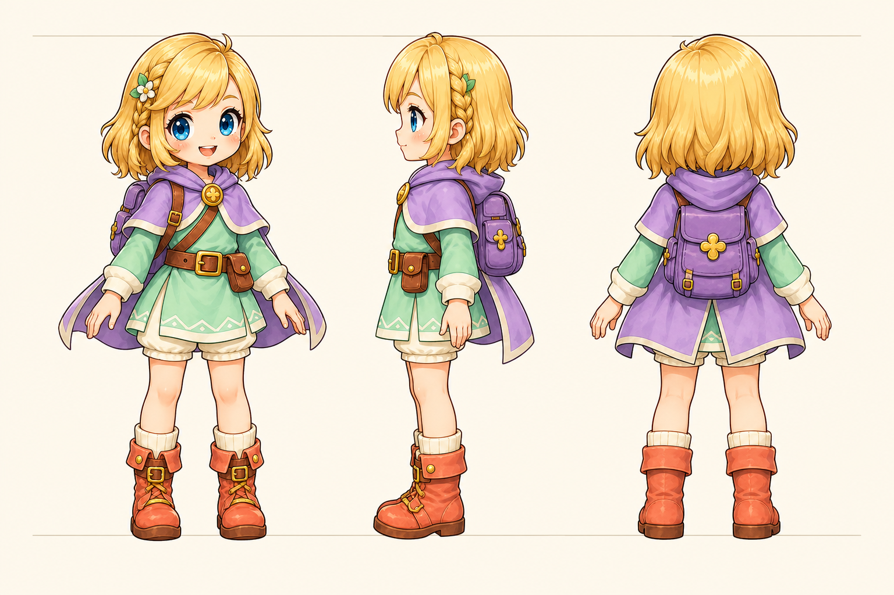
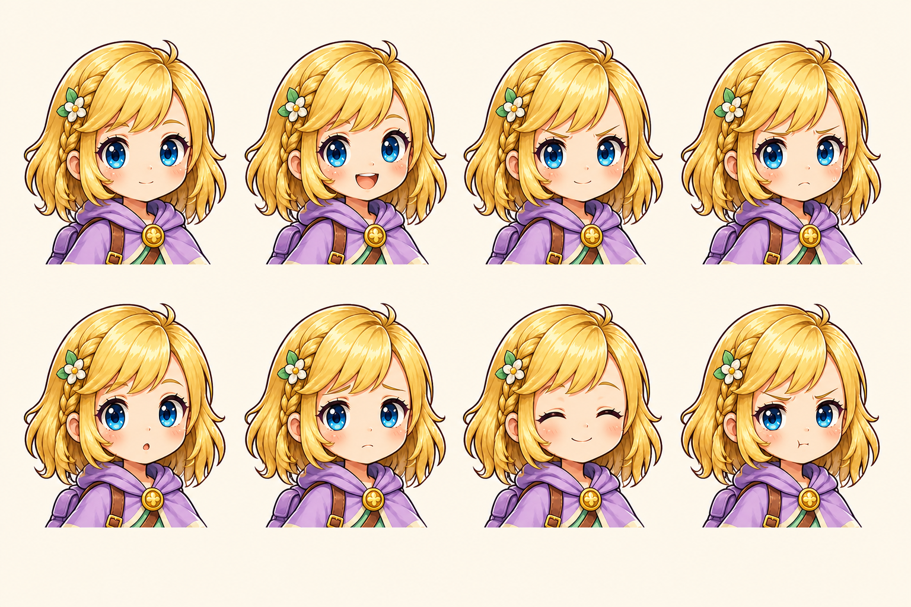

# Ame model sheet — v02 approved design direction

Status: **IDENTITY/CONSTRUCTION AND `mgjrpg-02` STATIC RENDERING DIRECTION APPROVED — CLEANED RUNTIME DERIVATIVE PENDING**

Recommended static study: `ame-v02-candidate-c`

Runtime selection: unchanged historical v01 at `public/assets/ame.png`

Identity-source recipe: historical `mgjrpg-01`; approved rendering profile:
`mgjrpg-02` revision 4 / `storybook-local-contour-v1`;
cutout/registration recipe: `art-pipeline-v1`

Human/Ame design gate: **approved 2026-09-03**

Human/Ame static rendering direction: **Fresh B-led 01 approved 2026-09-03;
cleaned derivative and runtime publication not approved**

This sheet records one approved restrained evolution of the Ame the child
already knows. It is deliberately not a redesign. Candidate C was selected
because its shoulder-brushing layered hair is meaningfully longer than the
historical bob, its irises remain visibly blue at the smallest field sizes, and
the warm young face, mint/lavender adventurer costume, backpack, flower, braid,
straps, pouch, and boots remain recognisable.

Candidate C is a globally regenerated image that stayed on model; it is not a
pixel-local eye edit. Candidate A remains the rollback/comparison anchor and B
the conservative short-hair comparison. No generated study below is an
animation frame, story portrait, or production pose.

## Human review board

Recommended static source (the painted checkerboard is source evidence and is
removed only in the separate deterministic proof derivative):

Candidate C turnaround construction study:

Candidate C expression construction study:

The two construction sheets are consistency references, not separable approved
sprites. Exact prompt/output provenance is appended to
`docs/AI_ASSET_PROMPTS.md` and cross-linked by
`docs/source-assets/records/ame-v02-source.json`.

## Immutable identity rules

Every depiction must keep all of these:

- Golden-blonde hair. Brown, ash, white, orange, or green-blonde is a failure.
- Clearly blue irises at actual size. Teal, turquoise, green, violet, gray, or
  merely blue-named source pixels that read green at 56–77 px are failures.
- A warm, round, recognisable young face: broad cheeks, high forehead, small
  nose/mouth region, friendly brows, large but not glamorous eyes.
- Mint tunic; cream undershirt, cuffs, shorts, socks, and hem marks; lavender
  cape/hood and backpack; brown strap/belt/pouch; coral boots; gold hardware.
- Left-side braid, white five-petal flower with gold centre and green leaf pair,
  side-swept fringe, crown curl, flower clasp, diagonal chest strap, belt and
  viewer-right pouch, square boot buckles, and practical backpack.
- Childlike 2.9–3.1-head field proportion. No adult lengthening, makeup, pin-up
  stance, armour-up, high heels, exposed midriff, or ornamental accumulation.

## Canonical swatches

These are design/QA tokens, not commands to posterise every painted pixel.

| Part | Light | Local/mid | Grouped shadow | Rule |
| --- | --- | --- | --- | --- |
| Hair | `#FFF2B8` | `#F6C55F` | `#D9933E` | Warm golden hue; never ash or orange-brown |
| Iris | `#F3FBFF` catchlight / `#69AFE8` light | `#347FD1` | `#182D68` rim | Broad iris hue must remain at least 200 degrees; no teal/green read |
| Skin | `#F9D1B0` | warm peach local | soft rose grouping | Preserve cheek warmth; no cosmetic blush mask |
| Mint cloth | soft paper highlight | `#A8DFC8` | `#5F9A78` | Largest costume colour field |
| Lavender | soft lilac highlight | `#C7A9E5` | `#784787` | Cape, hood, backpack identity family |
| Coral leather | warm peach edge | `#EE826F` | warm russet group | Boots only; do not spread across costume |
| Brown leather | narrow warm edge | `#7C3B27` | deep brown/plum | Strap, belt, pouch construction |
| Gold | cream pin | `#F5BF4F` | amber ochre | Clasp and hardware, not all trim |
| Line | — | `#4C2D5D` | `#34203F` | Plum, never pure black sticker edge |

At 56 px, Candidate C retains eight blue-qualified and zero teal-qualified iris
pixels in the current audit. At 64 px it retains nine blue and zero teal. The
lower cyan light still receives deterministic palette QA; contiguous broad iris
regions below 200 degrees fail even when highlights pass.

### Rendering-profile compatibility

Candidate C is the immutable approved **identity and construction** anchor. The
PPBA-informed `mgjrpg-02` canary is a rendering calibration, not permission to
change her face, golden-blonde hair, blue eyes, proportions, costume, pose
landmarks, registration, or personality. Her historical source remains truthfully
labelled `mgjrpg-01`; do not relabel or overwrite it.

For compatible production derivatives, preserve two to four large colour masses,
three broad value groups, one face-first focal hierarchy, and restrained surface
frequency. A proposed local-material contour may shift toward blonde-russet,
mint/leaf-plum, lavender/aubergine, coral/russet, and cool blue-plum while
remaining visibly part of Maze's deep-plum family. The darkest plum remains at
eyes, mouth, deep occlusion, and critical separation. No uniform pure-black
perimeter, rainbow edging, white sticker halo, plastic gloss, or micro-detail is
introduced.

If applying that calibration materially changes pixels, create a new versioned
candidate/derivative and compare it with Candidate C at 56, 64, 77, 84, and
103 px in the consolidated canary packet. A surface-treatment change that alters
identity or actual-size recognition returns to Human/Ame review. Candidate C's
existing approval remains intact if the experiment is rejected.

For this gate, every contour segment must be derived from the nearest interior
material rather than from a universal black stroke: warm-gold plum around hair
and gold, leaf-plum around mint, aubergine around lavender, russet-plum around
coral/leather, blue-plum around blue/cool material, and cream-mauve around pale
cloth. `ink-900` remains reserved for pupils, mouth, deep occlusion, and a very
small critical separation. Contour changes align to stable material or
construction joints; a pixel-by-pixel hue fringe, soft halo, matte edge, broken
stroke, or low-contrast pale perimeter fails even if it looks attractive at
source size.

The delivered Ame proof must show a 3–5 px continuous outer contour at 512 px,
2–3 px at 256 px, 2 px at 103/84 px, and a 1.5–2 px optical edge at
77/64/56/40 px. One-pixel structural marks may remain only when they carry the
face or construction; there is no cream/white sticker cutline around field Ame.
The complete token, contrast, and raster-width authority is
`docs/ART_BIBLE.md`.

## Facial construction

- Eye centres in the unregistered generator original are approximately
  left `(0.486,0.248)` and right `(0.594,0.238)`. The slight vertical offset is
  the front-three-quarter turn, not mismatched anatomy.
- One eye width separates the inner eye masses optically. Upper lash/iris rim is
  the darkest facial mark; lower rim is shorter and softer.
- Each open eye uses one dark pupil, one principal near-white catchlight, and one
  small support light. Do not add star fields, gradient glitter, or green lower
  reflections that change the actual-size colour read.
- Brows sit clear of the lashes and do most emotional work. Nose is one tiny warm
  mark. Mouth is a simple shallow shape centred under the nose; teeth/tongue are
  presentation detail only when they survive the crop.
- Cheek width, chin height, ear placement, forehead, fringe opening, and smile
  corners are identity landmarks. A polish pass may not narrow the face or move
  both eyes without returning to Human review.
- `faceSafeBox` in the normalized square candidate is `(0.39,0.19,0.25,0.20)`.
  Hair, props, cage bars, effects, and hands may not cross both eyes.

## Hair decision and landmarks

The recommended target is a **restrained shoulder-brushing layered lob**:

- Crown remains rounded with the single upward curl.
- Side-swept fringe opens the face on viewer-right; it does not become curtain
  bangs or conceal an eye.
- Viewer-left braid starts above the temple and ends near the ear. Flower and
  leaves stay above it as one identity cluster.
- Back mass reaches the shoulder line. Selected outward tips provide a layered
  silhouette; bulk does not extend down the cape or turn into long hair.
- The widest hair mass stays around cheek/jaw-to-shoulder level. The neck and
  cape collar remain readable. Strands are grouped into broad locks, not noodles.
- Normalized `hairEnvelope` is `(0.30,0.08,0.40,0.33)`. Secondary motion remains
  inside it except for an explicitly approved anticipation/extreme frame.

Candidate B is not recommended because its rounded lob remains too close to
freezing the old bob. Candidate A established the preferred longer silhouette;
Candidate C preserves that silhouette while increasing blue-eye readability.

## Costume landmarks

Front and three-quarter views preserve this top-to-bottom order:

1. Lavender hood/capelet with cream edge and one gold flower clasp.
2. Brown backpack strap crossing from viewer-left shoulder to viewer-right waist.
3. Mint long-sleeved tunic over cream cuffs and undershirt.
4. Brown belt with central gold buckle and one viewer-right pouch.
5. Quiet cream geometric tunic-hem band; it is construction trim, not a new motif.
6. Cream shorts and sock cuffs.
7. Coral practical boots with brown soles, square buckles, and simple laces.

Side/back construction uses the turnaround study with these corrections locked:
the backpack is lavender, centred on the back, and practical rather than ornate;
the cape divides around/behind it; the diagonal strap has a plausible attachment;
the pouch remains on Ame's left hip (viewer-right in the front study); braid and
flower remain on Ame's left and may become only partly visible from the back.
No back-only pocket, charm, bow, gem field, or second clasp is added.

## Front, side, and back silhouettes

- **Front:** round shoulder-brushing hair, small crown curl, flower/braid notch on
  Ame's left, cape triangle, tunic trapezoid, separated hands, sturdy boot pair.
- **True left side:** forehead/fringe step, short layered hair tail, small flower
  and braid relief, cape/backpack depth, pouch projection, one grounded boot
  plane. Do not flatten the backpack into the cape.
- **Back:** rounded layered hair ending above the backpack, centred lavender bag,
  cape sides framing it, tunic/short break, parallel boot pair. Hair may obscure
  the collar but not the entire bag.

At 64 px solid black, front/three-quarter must remain distinguishable from every
friend and enemy through the hair/cape/backpack/boot rhythm. The construction
study is the approved visual silhouette reference; no separate back/side runtime
pose is authorized yet.

## Expression vocabulary

The eight required expressions keep identical skull, hair, eyes, and crop:

| Expression | Brows/eyes | Mouth/cheeks | Emotional ceiling |
| --- | --- | --- | --- |
| Neutral attentive | relaxed raised brows, centred pupils | tiny closed smile | Ready and listening |
| Open joy | lifted brows, bright open eyes | simple open smile | Delight, not glamour |
| Quiet determination | brows gently in/down, steady pupils | small confident curve | Brave, never angry |
| Worried concentration | inner brows raised, focused eyes | small downturned mouth | Concern, not fear |
| Gentle surprise | lifted brows, rounder eyes | small `o` | Discovery, not shock |
| Soft sadness | inner brows raised, softened lids | tiny low curve | No streaming tears/distress |
| Relief | eyes may close in soft arcs | easy smile, warm cheeks | Release, not laughter fit |
| Playful annoyance | one brow lower, direct pupils | tiny side/pout mark | Comic, never contemptuous |

## Registration and safe zones

Candidate targets after deterministic cutout/re-registration on a square canvas:

| Anchor | Normalized | 512 px proof target |
| --- | --- | ---: |
| Pivot / ground contact | `(0.50,0.90)` | `(256,461)` |
| Visible bounds target | approximately `(0.29,0.08,0.43,0.82)` | `(148,41,220,420)` |
| Face-safe box | `(0.39,0.19,0.25,0.20)` | `(200,97,128,102)` |
| Eye line | approximately `0.28` | `143` |
| Primary hand socket | `(0.66,0.58)` | `(338,297)` |
| Hair envelope | `(0.30,0.08,0.40,0.33)` | `(154,41,205,169)` |
| Cape/backpack motion envelope | `(0.25,0.35,0.52,0.34)` | `(128,179,266,174)` |

Canvas safe inset is 8% top/left/right and at least 6% bottom. The immutable
generator original fails the top inset, so the normalized proof must scale and
translate the subject without stretching. The cleaned candidate must have four
fully transparent outer pixels, straight alpha, 2–4 derivative-pixel RGB
dilation under zero alpha, opaque material cores, and no checker islands in
hair/cape openings.

The primary hand socket is the centre of the viewer-right hand used by the
current held-weapon presentation. Candidate C must not inherit the historical
socket blindly: the v01 socket is near `(0.690,0.607)`. Every weapon later records
its own grip, rotation, held scale, and z-order and must be tested at 56, 77, and
103 px without crossing the face or clipping the canvas.

Animation registration, when released after approval, locks crown, eye line,
face box, shoulders, pelvis, both hands, ground contact, hem, boot soles, bag,
and cape/hair envelopes. Deliberate squash/stretch must be annotated per frame.

## Actual-size and context proof contract

Generated proof outputs are local review artifacts under ignored
`artifacts/art-proofs/`; they are not runtime files and add zero public bytes.
The proof index records hashes and exact sources.

Required static proof:

- v01 / Candidate A / Candidate B / Candidate C source comparison, with v01's
  teal eye read labelled historical rather than canonical.
- Candidate C at 56, 64, 77, 84, and 103 px on paper, ink-900, 50% gray,
  magenta, cyan, meadow grass, moon slate, rose brick, and woodland dirt.
- Solid-black 64 px silhouette; eye close-up and 56/77 px pixel grids; pivot,
  baseline, face-safe, hair/cape envelope, and hand-socket overlays.
- A provisional Moon Wand socket overlay at 56/77/103 px, using the current
  presentation transform only to expose face overlap, grip, and clipping risk.
  Full shortest/widest/longest and all-eight-weapon calibration is deliberately
  released by Human design selection but remains part of the versioned runtime
  derivative/family gate; it must not turn a source study into an implicitly
  approved runtime body model.
- Alpha boards on white, black, gray, magenta, cyan, and noisy terrain at 100%
  and 200%; reject white/gray matte, checker residue, pinholes, or erased cream.
- Browser captures at 844x390, 960x540, and 1280x720 of the source-only context
  harness, which presents exact 56/77/103 px canvases over meadow grass, moon
  slate, and rose brick. Separate live Shiny Sword captures verify the active
  historical v01 scale. The harness does not switch the live catalogue or imply
  runtime approval; full in-game multi-maze pointer review follows the versioned
  derivative and catalogue-switch proposal.
- One consolidated `mgjrpg-01` versus proposed `mgjrpg-02` rendering board that
  keeps Candidate C geometry registered exactly, shows source and
  512/256/103/84/77/64/56/40 px delivery views, and includes close contour crops
  across blonde, mint, lavender, coral/leather, cream, and blue eye regions on
  paper, dark plum, middle gray, saturated magenta/cyan, and representative game
  backgrounds. The board must identify any generated assay as a surface study,
  never a replacement identity source.

Canonical review locations:

- `artifacts/art-proofs/canary/ame-v02-comparison.png`
- `artifacts/art-proofs/canary/ame-v02-model-studies.png`
- `artifacts/art-proofs/canary/ame-v02-actual-sizes.png`
- `artifacts/art-proofs/canary/ame-v02-registration.png`
- `artifacts/art-proofs/canary/ame-v02-alpha-fringe.png`
- `artifacts/art-proofs/canary/ame-v02-contour-edge-400pct.png`
- `artifacts/art-proofs/canary/ame-v02-held-moon-wand.png`
- `artifacts/art-proofs/browser/ame-v02-source-only-harness-{844x390,960x540,1280x720}.png`
- `artifacts/art-proofs/browser/current-shiny-sword-{844x390,960x540,1280x720}.png`
Historical rejected post-process evidence:

- `artifacts/art-proofs/mgjrpg-02/v08/mgjrpg-02-comparison-packet.png`
- `artifacts/art-proofs/mgjrpg-02/v08/mgjrpg-02-contour-crops.png`
- `artifacts/art-proofs/mgjrpg-02/v08/mgjrpg-02-actual-size.png`
- `artifacts/art-proofs/mgjrpg-02/v08/mgjrpg-02-terrain-repeat.png`
- `artifacts/art-proofs/mgjrpg-02/v08/mgjrpg-02-cvd-grayscale.png`
- `artifacts/art-proofs/mgjrpg-02/v08/mgjrpg-02-report.json`
- `artifacts/art-proofs/mgjrpg-02/v08/proof-index.json`
- `artifacts/art-proofs/mgjrpg-02/v08/index.html`
- `artifacts/art-proofs/mgjrpg-02/v08/candidates/`
- `artifacts/art-proofs/mgjrpg-02/v08/delivery/`

Historical authored rendering-direction selection packet:

- `artifacts/art-proofs/mgjrpg-02/v11/index.html`
- `artifacts/art-proofs/mgjrpg-02/v11/mgjrpg-02-authored-directions.png`
- `artifacts/art-proofs/mgjrpg-02/v11/ame-source-comparison.png`
- `artifacts/art-proofs/mgjrpg-02/v11/ame-actual-size.png`
- `artifacts/art-proofs/mgjrpg-02/v11/ame-contour-background-closeups.png`
- `artifacts/art-proofs/mgjrpg-02/v11/mgjrpg-02-options-report.json`
- `artifacts/art-proofs/mgjrpg-02/v11/proof-index.json`
- `artifacts/art-proofs/mgjrpg-02/v11/derived/`
- `artifacts/art-proofs/mgjrpg-02/v11/delivery/`

Human-reviewed v14 rendering-selection packet:

- `artifacts/art-proofs/mgjrpg-02/v14/index.html`
- `artifacts/art-proofs/mgjrpg-02/v14/ame-fresh-source-comparison.png`
- `artifacts/art-proofs/mgjrpg-02/v14/ame-fresh-actual-size.png`
- `artifacts/art-proofs/mgjrpg-02/v14/ame-full-sprite-actual-size-backgrounds.png`
- `artifacts/art-proofs/mgjrpg-02/v14/ame-fresh-contour-background-closeups.png`
- `artifacts/art-proofs/mgjrpg-02/v14/future-enemy-comparison.png`
- `artifacts/art-proofs/mgjrpg-02/v14/rose-floor-pad-comparison.png`
- `artifacts/art-proofs/mgjrpg-02/v14/rose-floor-pad-actual-size.png`
- `artifacts/art-proofs/mgjrpg-02/v14/mgjrpg-02-selection-report.json`
- `artifacts/art-proofs/mgjrpg-02/v14/proof-index.json`
- `artifacts/art-proofs/mgjrpg-02/v14/derived/`
- `artifacts/art-proofs/mgjrpg-02/v14/delivery/`

The preserved `v01` packet is a rejected deterministic calibration draft. Its
source contour was too wide and its semantic cream classifier overpainted
interior details; it is evidence of iteration, not an approved or reusable
authority.

The canonical proof derivative locations are recorded in
`docs/source-assets/records/ame-v02-source.json`; `npm run art:proof` rebuilds
the historical Candidate-C boards and `npm run art:proof:mgjrpg02` rebuilds the
historical rejected contour-assay packet. `npm run
art:proof:mgjrpg02:selection` built the immutable v14 bounded response and now
refuses to overwrite it; any later proof change requires a declared revision
bump. Runtime approval will
require an actual in-game catalogue-pointer review after the versioned production
derivative is ready; the completed design gate intentionally stopped before that
switch.

## Human/Ame approval checklist

After reviewing the comparison, actual-size, and model-study sheets on
2026-09-03, the Human said: **“I've reviewed the images and comparison sheets
and I'm happy with the reccomendations.”** The manager-normalized outcome is:
**Candidate C is the canonical static Ame v02 design direction.**

- [x] This still looks and feels like Ame: same warm face and young age.
- [x] Hair is unmistakably golden blonde in source and actual-size proofs.
- [x] Irises are clearly blue—not teal or green—at 56, 64, 77, and 84 px.
- [x] The shoulder-brushing softly layered length feels right; it is neither the
  immutable old bob nor unexpectedly long/adult/glamorous.
- [x] Mint tunic, lavender cape/backpack, braid/flower, strap, belt/pouch, cream
  layers, coral boots, and gold landmarks are all correct.
- [x] Front/side/back construction describes the same person and practical outfit.
- [x] Neutral, joy, determination, worry, surprise, sadness, relief, and playful
  annoyance all remain kind and recognisable.
- [x] 64 px silhouette, face-safe zone, ground registration, hand socket, and
  cleaned alpha edges are acceptable.
- [x] Candidate C is the canonical static Ame v02 identity/construction;
  Plan 03 rendering/runtime production remains separate, and the approved
  identity may feed later Plan 05 animation after its roadmap predecessors pass.

Approval must be explicit; absence of requested revisions is not approval. If a
bounded change is requested, preserve this candidate and provenance, make only
that change, bump candidate/derivative identity as required, and return to this
same gate.

### Separate Human rendering gate — recipe direction approved

The identity checklist above is complete and must not be reopened. The Human
reviewed the consolidated cross-family packet and selected Fresh B-led 01 as
Ame's static `mgjrpg-02` rendering reference because its face and silhouette
read more clearly at her normal small gameplay scale. Fresh B-led 02 was liked
at higher resolution but was not selected. This was a decision about local
contour colour/value, continuity, three-value grouping, material simplification,
and actual-size clarity only—not approval of a new Ame face, hairstyle,
costume, pose, proportion, registration, cleaned cutout, or runtime asset.

The Human rejected v08 as a meaningful rendering choice on 2026-09-03. Its
post-process contours were too dark at actual size and left the old interior art
substantially unchanged. This did not reject Candidate C. The historical `v11`
gate used three independent, newly painted rendering-only candidates from this
immutable source: A — Luminous Storybook Cel, B — Soft Jewel Gouache, and C —
Chunky Enamel Adventure. The generated RGB originals and their checkerboard
defect remain untouched; deterministic cutout derivatives are proof-only. The
v11 preselection recommended A as the base rendering language, with C's stricter
small-size simplification applied as an optical rule—not C's changed Ame
construction or more global violet perimeter.

Human rendering feedback later on 2026-09-03 superseded that global
preselection for Ame: the Human selected **Direction B's surface appeal**, while
identifying subtle accumulated high-frequency “deep-fried” texture in that
comparison candidate. The Human requested a new blank-canvas attempt in the
same clean B language and explicitly retained prior Direction B as the fallback
if a fresh drawing is worse. This is a rendering preference only; Candidate C
remains the sole identity/construction authority.

Two independent fresh studies are preserved under
`docs/source-assets/calibrations/mgjrpg-02/v03/`. Neither received prior B or the
other fresh study as a generation input. The Human's selection does not promote
Fresh B-led 01 to identity/construction authority: Candidate C remains the sole
source for eye openings and spacing, cheek/chin/mouth relation, fringe and
hair-tip rhythm, cape/backpack silhouette, stance and boot angles,
registration, and the viewer-right hand socket. Production may borrow Fresh
B-led 01's approved rendering craft only. If applying it shifts those landmarks,
the candidate is rejected rather than silently redesigning Ame.

- [x] Candidate C identity/construction remains the immutable reference.
- [x] The Human selected Fresh B-led 01's colour-aware contour, broad-value, and
  small-scale rendering direction; this does not approve its opaque source
  background or a cleaned runtime derivative.
- [ ] The production derivative preserves Candidate C's face, age,
  golden-blonde hair, blue-eye read, costume allocation, silhouette,
  registration, hand socket, and emotional character.
- [ ] The cleaned 40–103 px derivative keeps a continuous silhouette without
  uniform black edging, muddy pale edges, chromatic halos, hue fragmentation,
  matte contamination, or accumulated texture.
- [x] Fresh B-led 02 is retained as an unselected high-resolution comparison;
  prior Direction B remains historical rollback evidence rather than a runtime
  or new-generation authority.
- [x] The selected family recipe is frozen into approved recipe revision 4 with
  measured brighter contour targets; v08's dark r02 tokens remain rejected
  history and r03's pending state remains an immutable snapshot.
- [ ] A separately versioned runtime derivative and catalogue-pointer proposal
  pass their later public-byte, rights, live-context, and rollback gates.

## Released by identity and recipe approval; derivative/runtime gates still open

- Candidate C may now feed a controlled static rendering-production candidate
  using Fresh B-led 01's craft reference. It may not be published through a
  versioned runtime derivative until that cleaned candidate's identity,
  alpha/actual-size, rights, live-context, byte-allocation, catalogue-switch,
  and rollback gates pass; the v01 pointer remains active.
- Controlled friend, cage, enemy, weapon, terrain, prop, and icon source batches
  may proceed under recipe revision 4. Each batch still requires an explicit
  Human response before approve-by-exception applies; silence is not approval.
- Dependent Ame poses, expressions, story variants, and animation-ready variants
  remain deferred until the canonical static derivative passes. Animation is
  owned by Plan 05.
- Plan 01 and Plan 05 still wait for manager acceptance of completed Plan 03;
  this design decision alone is not a downstream implementation release.
- The separate source licence/rights field remains open until independently
  reviewed; visual approval does not fabricate that evidence.
