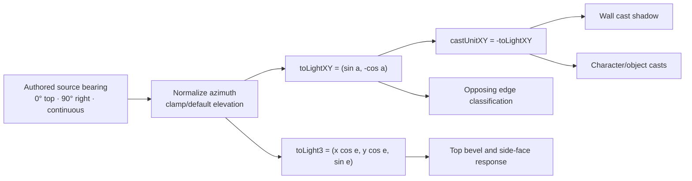
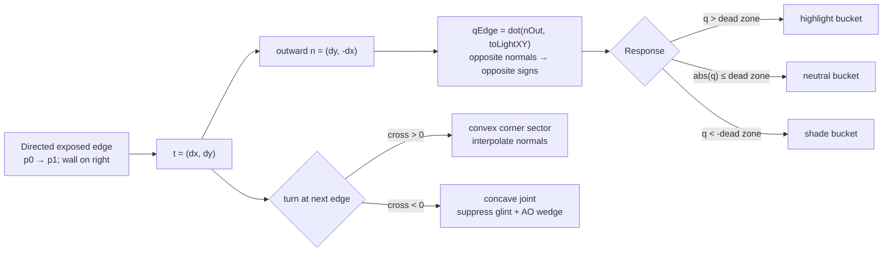
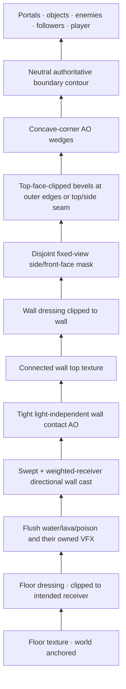
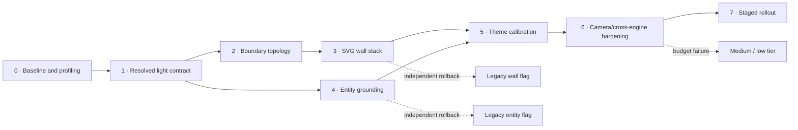

# Lighting and wall-depth implementation plan

## 0. Manager-reviewed execution addendum

Read `docs/GAME_VISION_AND_DESIGN_SPEC.md`, `docs/plans/00-integrated-implementation-roadmap.md`, the accepted Art Bible, UI/UX spec, and this complete plan before implementation. Execution is gated on Plans 07A, 06, 03, root checkpoint 03M, 01, and the Human-approved movement-comfort checkpoint before FP-UI1. This addendum supersedes conflicting planning details.

### Execution refinement — 2026-09-05

Make the maze feel like a small, inviting place whose paths are easier to read.
The valuable result is coherent wall form, stable grounding and recognizable
materials; extra darkness, filter count or geometric complexity is not success.
Begin with the accepted FP-UI1 movement baseline and one compact comparison rack:
a pale wall, dark wall, foliage/crystal, a one-tile corridor and mixed hazards.
Prove signed bevels, an internal side face, a restrained cast and actor contact
together before tuning every material. If a detail disappears at actual tile
size, reduce it before allocating more paths, filters or authored assets.

Preflight the actual catalogue, source records and scene exports. For each
consumed geometry class/material recipe, record the exact ID/revision, pivot or
base landmark, shadow eligibility, neutral/light profile, material-profile
fallback and representative proof. A declared field is not evidence that its
value fits the approved actor: overlay the ground/base on real sprites,
including grounded, floating, coiled, tiny, large and chest-shaped examples.
Missing geometry/material metadata returns by exact ID to root/art authority;
derive and validate metadata from approved sources without reopening their style
or changing their pixels. Complete this bounded seam before broad calibration.

The accepted smooth-travel system owns actor translation, camera position,
retargeting and its visual culling interval. Lighting must consume that live
contract, including the full swept viewport during rapid holds/turns. Historical
120 ms CSS transitions in the audit are not a duration to restore. Shadows follow
the same rendered world position as their actor and share its ground-plane
projection through jump/portal handoffs; they cannot snap to the logical target
while the actor is still travelling. Rendering a halo must not reveal hidden
objects, enemies or unexplored terrain through fog.

Regions create landmarks through harmonious material contrast, never false
collision edges. Freeze a tiny complete base-recipe/two-region example, then the
existing four-region ceiling and invalid-input fixtures. Do not author all
campaign regions here. Hand Plan 09 documented recipe/region IDs, fallback rules,
seam examples and measured cost so it can place purposeful places with no new
renderer work. All regions share one light.

Requalify the FP-UI1 sustained-travel route with lighting on: holds, corners,
reversals, outer edges, five followers, portal cuts and Normal/Big layout changes.
No new judder, texture crawl, caster pop or visible corridor narrowing is
accepted. Full/lower tiers must preserve that evidence and the same route truth.
Use the existing shared harness and budget ledger; a later Plan 07B pass does
not defer an attributable regression or waive this checkpoint's gates.

### Human playtest refinement — v0.20.1, 2026-09-05

Source: [numbered playtest intake](../playtests/2026-09-05-v0201-wishlist.md),
items 1, 2, 5, 6, 7, 9, 12 and 13. These are observations about v0.20.1 and
future acceptance requirements, not claims that the running Plan-01 candidate
has been reproduced or reviewed. Do not interrupt that task or edit its files.

- `PT-20260902-15` and `PT-20260903-24`: give every floor texture, wall texture
  and overlay a declared receiver/job and validate recipes against that role.
  A valid floor/wall ID pairing is necessary but does not prove visual clarity:
  the Human reports both surfaces read as floors in `springstep-sky-hollow`.
  Its current `springstep-hollow` recipe already selects separate floor and wall
  catalogue entries; inspect the actual composite before claiming swapped URLs.
  World-anchored repeat scale must make masonry, grass, leaves and seams feel
  plausible beside Ame at the real tile size. Compare approved harmonious
  pairs, including bright/bright and low-contrast cases, at rest and in travel.
  Show recognisable floor versus raised wall in colour and grayscale without
  relying only on hue or an added dark outline. Keep dressing on its declared
  receiver and preserve the walkable boundary at every scale and quality tier.
- Improve depth with coherent signed bevels, internal faces, contact/cast and
  material response already owned here. Evaluate representative pairs before
  requesting more texture production. If existing approved art cannot fulfil a
  specific material role, return an exact recipe/source/consumer request to
  root's bounded art gate; this plan cannot independently repaint the catalogue.
  Hand Plan 09 a reviewed pair/scale matrix, incompatibilities and complete
  fallback recipes so authored and generated variety uses intentional pairs.
- `PT-20260905-33`: investigate the faint dark vertical edge reported roughly
  one quarter of the way from the viewport's left side, drifting/fading during
  play in `rainbow-power-parade` and `twilight-treasure-loop`. Cause is unknown.
  Reproduce with fixed route, camera position, viewport/DPR and animation phase;
  isolate terrain filters/masks, camera clipping, light/shadow and decorative
  overlays one at a time. Record the responsible layer only after a controlled
  comparison. Require settled and intermediate-frame evidence across horizontal
  and vertical travel, reversals, clamped edges, Normal/Big and reduced/static
  modes. A paused good frame alone cannot close this moving artifact. Root
  observes the same route during MOVE-01; an attributable early regression is
  handled there, while this plan owns the unresolved terrain/lighting repair.
- `PT-20260905-36`: preflight the art-owned held composition for
  `bubble-ring-blade`. The current source record deliberately publishes
  `zOrder: 1`, while the seven other weapons publish `3`; this is evidence for
  a targeted comparison, not evidence that the Human likes that layering.
  Root's art return owns any approved grip/scale/order metadata correction and
  regenerated consumers. Compare readable foreground placement in the existing
  static body, movement and combat compositions before freezing Plan-05 sockets.
  Do not patch a weapon-name CSS exception or change its identity here.
- `PT-20260905-38`/`39`: retain actual-size evidence of any sprite softening
  during scale/warp motion, distinguishing texture sampling from new lighting
  blur. Plan 05 owns the motion correction; 07B qualifies integrated sampling.
  The Human's six candidate art reviews are `moon-bat`, `pebble-golem`,
  `hedgehog`, `alpaca`, `rainbow-horn-unicorn` and `penguin`. Only those exact
  identities enter root's bounded comparison/correction gate if the Human
  chooses a replacement; other accepted art remains closed. Apply accepted
  metadata/rendition changes to the lighting rack without making a new global
  art approval round or concealing the source issue under a lighting filter.

### Adopted integration requirements

- Final Plan-03 art/material metadata is a hard dependency. Lighting owns runtime illumination, topology, wall depth, highlights, contact/cast shadows, and theme calibration; it does not independently repaint materials or change the catalogue's visual language.
- Resolve wall response through catalogue-defined, versioned material-profile IDs. The lighting implementation must enumerate the accepted catalogue/region recipes at execution time; it must not preserve a closed hard-coded union or switch on theme names, asset filenames, or campaign position.
- Static character art retains soft neutral form shading. Runtime lighting grounds opaque sprites with separate contact/cast surfaces; it does not pretend to relight their internal pixels. VFX owns local magical glows/flashes in assigned layers.
- Resolve entity grounding from art-owned metadata: runtime-shadow eligibility, grounded/floating/flush mode, normalized ground pivot, physical height class or coefficient, and emissive policy. Unknown entries use the declared geometry-class fallback and a diagnostic; no filename, label, species, or enemy-name switch may determine a shadow.
- Hazards are flush surfaces: they may receive a restrained wall cast shadow through the approved receiver mask, but water, lava, poison, portals, and other flat emissive fields do not cast wall-like shadows themselves.
- Consume the Plan-01 MazeViewport host, scene slots, CSS layer names, and transform hierarchy. Do not hard-code a legacy `.game-stage` or introduce a competing layer system.
- Establish the one shared cached `MazeTerrain` extraction, boundary topology, world mask, gutter, and compositing order. Lighting owns wall/topology/grounding layers; Plan 02 later attaches moving material/emissive/transient layers to this seam.
- Make that render model catalogue- and region-aware before Plan 09. A level may
  resolve each tile to a stable named visual region whose valid environment
  recipe supplies floor, wall, dressing and material calibration. Region masks,
  texture origins and transitions are world-coordinate cached presentation data;
  they never fork terrain collision or solver topology. A single-region level
  remains the zero-cost/default contract. The seam accepts exactly one fixed
  `EnvironmentManifest` with a required base/default complete recipe and one to
  four complete named region assignments; reject empty, uncovered, overlapping
  or more-than-four-region manifests.
- Provide synthetic two-region, portal-island and quadrant fixtures proving
  complete assignment, connected-wall transitions, camera/portal continuity,
  gutter coverage and safe fallback to the declared base recipe. Do not fill the
  campaign matrix here: Plan 09 authors fixed regions after this seam lands.
- Preserve one resolved maze-wide light in this version. Regions may use their
  own material-response calibration but do not invent independent light vectors;
  multiple unrelated light sources need a later explicit scene-light contract.
- Create dedicated shadow and sparkle nodes/wrappers. Fix the current `.player-layer::before` collision structurally so VFX can style sparkle without taking grounding ownership.
- Preserve explicit varied authored light angles and deterministic generated bearings. New curated levels, including Plan 09, must set intentional light metadata rather than depend on title/order hashes.
- Aim for materially more believable three-dimensional walls while preserving clean anime-JRPG stylization, path readability, and the authoritative collision silhouette. Photorealistic grime, heavy darkness, and corridor-obscuring extrusion are out of scope.
- Treat numeric render budgets as provisional until Plan 07B. TV, desktop, and iPad use the same default approved quality; lower quality is capability-measured, not device-name guesswork, with phone the acceptable lower-priority fallback.

### Documentation and completion

Create and maintain `docs/LIGHTING_AND_DEPTH_SPEC.md` unless the accepted Art Bible already contains an unambiguous owned section, in which case update that and record the decision. Update `docs/ARCHITECTURE.md`, catalogue material metadata, audit, and release visual evidence when implementation ships.

Completion requires cardinal/diagonal/continuous direction proofs, every active material, single- and multi-region camera/portal seams, fractional/DPR rendering, dedicated entity grounding, hazard receiver behavior, full/medium/low tiers, reduced/contrast modes, TV/desktop/iPad/phone, packaged WebView, cache/rebuild counts, and all full project gates.

Status: planning and research only

Owner: maze lighting, wall depth, terrain-edge metadata, entity grounding, and theme lighting calibration

Inspected branch: `main`

Inspected commit: `c6b6628b6e651d18161a4d1302935d3096f665c6` (`Record 0.19.0 production verification`)

Application version at that commit: `0.19.0`

Date: 2026-09-02
Implementation performed: none

## 1. Decision summary

Use a hybrid SVG renderer: preserve the existing connected rounded wall silhouette as the single authority for walkable-space readability, but have geometry generation also return cached boundary topology. From that topology, build a small, constant number of compound SVG paths for:

- an inward top bevel shaded from per-edge normals;
- fixed-view front/side faces that imply wall height without rotating with the light;
- convex-corner bevel sectors and restrained concave-corner occlusion;
- narrow, light-independent wall-to-ground contact occlusion;
- one receiver-masked directional cast shadow;
- a neutral boundary contour that remains legible in every theme.

Replace the ambiguous cardinal-only vector with a resolved light object that explicitly distinguishes `toLight` from `castDirection`. Accept continuous authored azimuths, curate mostly on a 22.5-degree grid, and initially let generated levels choose one of eight 45-degree bearings. Retain the existing cardinal metadata and fallback behavior as a compatibility tier so shipping levels do not silently relight.

This approach offers materially better directional form than translated duplicates while retaining the existing textures, full-world camera continuity, DOM-based entity layers, and collision model. Canvas and WebGL remain escalation paths only if profiling disproves the SVG budgets in section 12.

## 2. Scope and non-negotiable invariants

This plan owns:

- the maze light metadata and deterministic resolver;
- connected wall top, bevel, side/depth, contact, and cast-shadow rendering;
- edge and corner topology needed by rendering;
- coherent contact and cast shadows for board entities;
- theme-level lighting calibration and accessibility safeguards;
- performance tiers, visual diagnostics, and seam validation for this system.

This plan does not own:

- hazard motion or particle effects;
- a general art-direction restyle;
- HUD or sidebar layout;
- sprite-frame animation;
- gameplay collision, pathfinding, or level topology;
- foreground wall occlusion or a new y-sorting system.

The implementation must preserve these invariants:

1. The original connected terrain silhouette remains the exact boundary authority. Lighting can reinforce it but cannot move collision or make an open tile look blocked.
2. Wall height is a view-space convention. It does not rotate when the scene light rotates.
3. Highlight, shade, and cast vectors come from one resolved light. No layer may invent its own directional convention.
4. Contact occlusion is short-range and mostly light-independent. Cast shadows are directional and height-dependent. They must be represented separately.
5. Terrain lighting is generated in world coordinates and cached per level content revision, visual-region assignment revision, material-profile revision, resolved light, and quality tier. Camera movement must translate the already-built world; it must not rebuild or re-anchor wall shading.
6. Hazards remain flush gameplay surfaces. Portals remain emissive/flat unless an object-specific height class explicitly says otherwise.
7. The renderer must have a deterministic low-quality fallback that preserves boundary contrast and grounding without blurred filters.

## 3. Repository and working-tree state inspected

The primary audit began on branch `main` at commit `c6b6628b6e651d18161a4d1302935d3096f665c6`. The branch was even with `origin/main` (`0 0`), and the initial tracked, staged, and untracked working tree was clean. A second repository audit at `2026-09-02T11:50:18.8159606+01:00` observed the same clean state.

Because several planning agents share this checkout, the state changed during research. Immediately before this document was created, at `2026-09-02T12:04:54.6646506+01:00`:

- `HEAD` was still `c6b6628b6e651d18161a4d1302935d3096f665c6` on `main`;
- `HEAD...origin/main` was still `0 0`;
- tracked unstaged changes: none;
- staged changes: none;
- pre-existing concurrent untracked file: `docs/plans/01-ui-ux-layout-overhaul.md`.

That concurrent file was not opened for editing and is not part of this plan's change set. Source references below are pinned to the inspected commit; line numbers should be re-resolved if implementation begins after rebasing or merging other plans.

At `2026-09-02T13:13:12.1485164+01:00`, concurrent planning had added further untracked files. `git status --short` coalesced them as `?? docs/plans/`; `git ls-files --others --exclude-standard` listed `01-ui-ux-layout-overhaul.md`, `02-graphics-vfx-overhaul.md`, `03-magical-girl-art-direction.md`, this `04-lighting-wall-depth.md`, `05-limited-sprite-animation.md`, `06-game-design-gameplay-ux-mechanics-plan.md`, `07-performance-web-tauri-plan.md`, and `08-controls-xbox-steam-deck-plan.md`. This task created and edited only `04-lighting-wall-depth.md`; the other seven remained untouched.

## 4. Current-state technical audit

### 4.1 Light metadata and resolution

| Area | Current symbol and exact inspected reference | Finding |
| --- | --- | --- |
| Type | `LightDirection` in `src/game/types.ts:19` | Only `top`, `right`, `bottom`, and `left` are representable. |
| Curated metadata | `LevelDefinition.lightDirection?` in `src/game/types.ts:188`; `AsciiLevelOptions.lightDirection` in `src/game/levels.ts:32`, copied at `src/game/levels.ts:297` | Metadata is optional. Only `Rainbow Power Parade` explicitly supplies `"left"` at `src/game/levels.ts:894`. |
| Curated fallback | `lightVector()` in `src/App.tsx:618-628` | Missing metadata is selected by the ASCII-character sum of `level.id` modulo four. This is deterministic but implicit, unversioned, and coupled to a presentation helper in the component file. |
| Generated metadata | `hashSeed()` in `src/game/generator.ts:62`; selection at `src/game/generator.ts:1166` | Generated levels choose `seedHash % 4`. Lighting is deterministic, but it shares the layout seed/hash and cannot produce diagonals. |
| Runtime vector | `lightVector()` in `src/App.tsx:618-628` | The returned vector points in the cast-shadow direction, away from the named source: top maps to `(0,+1)`, right to `(-1,0)`, bottom to `(0,-1)`, and left to `(+1,0)`. The name does not expose that semantic. |
| Consumers | `MazeTerrain` call at `src/App.tsx:654`; board resolution at `src/App.tsx:1293` and CSS variables at `src/App.tsx:2660-2661` | Terrain and entities call the resolver independently. CSS receives a five-pixel x and four-pixel y displacement from the same vector, but several sprite rules still use fixed downward shadows. |

At the inspected commit, the effective curated sequence is:

`bottom, left, top, right, top, top, bottom, right, right, bottom, left, bottom, bottom, bottom, left, left`.

The sixteenth entry is explicit; the preceding fifteen are hash fallbacks. This exact behavior is a compatibility fixture for migration tests.

### 4.2 Connected wall geometry

The wall silhouette is produced by `createRoundedCellUnionPath()` in `src/game/terrainGeometry.ts:310` and adapted to terrain/camera coordinates by `createRoundedTerrainPath()` at `src/game/terrainGeometry.ts:346`.

The current geometry pipeline is stronger than its lighting use suggests:

- `collectBoundaryEdges()` at `src/game/terrainGeometry.ts:121` already emits only exposed orthogonal unit edges.
- Directed edges keep wall material on their right. For tangent `t = (dx, dy)` in SVG coordinates, the outward normal is therefore `n = (dy, -dx)`.
- `chooseNextEdge()` at `src/game/terrainGeometry.ts:152` and `traceBoundaryLoops()` at `src/game/terrainGeometry.ts:170` preserve diagonally touching wall regions as separate loops.
- `removeCollinearPoints()` at `src/game/terrainGeometry.ts:215` simplifies straight runs.
- `roundedCorners()` at `src/game/terrainGeometry.ts:239` already calculates turn and sweep information for convex and concave corners.
- The return type currently discards this topology and exposes only the path string, fill rule, and loop count.
- `createRoundedTerrainPath()` supports a one-cell window gutter, but production `MazeTerrain` is passed a fresh `fullLevelWindow(level)` at `src/App.tsx:2683`, so that gutter is not used in the actual full-world renderer.

This means the recommended design is an additive geometry export, not a second contour tracer.

### 4.3 Current terrain paint stack

`MazeTerrain` begins at `src/App.tsx:630`. It builds separate wall, water, lava, and poison paths at `src/App.tsx:655-658`. Wall corner radius is `0.13` tile; hazard radius is `0.16` tile.

The effective wall stack is:

1. a blurred copy of the whole wall path using `wallDepthFilterId` and the `.terrain-wall-depth` layer (`src/App.tsx:653`, `src/App.tsx:727`, and `src/App.tsx:831-840`), filled `#332b58` at 0.34 alpha and translated 0.10 tile in the cast direction;
2. the connected textured wall top (`src/App.tsx:842-849`);
3. a uniform white outline of the same entire path (`src/App.tsx:851-860`), translated 0.025 tile toward the source;
4. optional wall dressing after the highlight (`src/App.tsx:862-869`).

The floor and wall SVG patterns use `patternUnits="userSpaceOnUse"` (`src/App.tsx:676` onward), which is the correct basis for world-anchored textures. Hazard masks use morphology and blur (`src/App.tsx:715-726`), while the hazard layers themselves are intentionally kept visually flat by CSS at `src/styles.css:1686` and `src/styles.css:5248`.

Technical consequences:

- The depth copy is a soft halo, not an extrusion. It has no view-facing side geometry and no wall-height model.
- Every boundary edge gets the same white highlight, including edges facing away from the light.
- Translation changes apparent outline placement but cannot encode surface normal or distinguish convex from concave corners.
- Dressing can cover the highlight because it is painted afterward and receives no shared lighting response.
- The filter uses one full-world blurred surface and fixed `x/y = -20%`, `width/height = 140%` padding at `src/App.tsx:727`. It does not declare `filterUnits` or `primitiveUnits`, and its percentage region is not derived from cast offset or blur support, so clipping and raster allocation still need validation.
- The combined result implies direction weakly on dark walls and can nearly disappear on pale walls.

### 4.4 Holes, hazards, dressing, and goals

- Hole/pit art is rendered as separate positioned PNG-backed elements at `src/App.tsx:659` and `src/App.tsx:872`; `src/styles.css:5924-5930` assigns z-index 2. The terrain SVG/wall plane is z-index 0 at `src/styles.css:3146-3155`, so a wall cannot locally occlude or cast correctly across a neighboring hole rim without an explicit receiver mask.
- Floor dressing is a full SVG rectangle at `src/App.tsx:814`, not a floor-only mask. It can exist under walls by paint order, but lighting does not modulate it.
- Wall dressing is supported and currently used by the lantern ruins family. It is not normal-aware.
- Water, lava, and poison are connected path masks and must remain zero-height surfaces. A wall shadow may fall across them only at capped opacity; no bevel or lip should be introduced by this work.
- The goal is a separate layer at `src/App.tsx:877` with z-index 5 at `src/styles.css:3157-3163` and a fixed sprite drop shadow at `src/styles.css:245-252`. It needs an explicit semantic height/shadow policy rather than inheriting that generic direction.

### 4.5 Entity shadow consistency

The board sets `--cast-shadow-x` and `--cast-shadow-y` from the level vector at `src/App.tsx:2660-2661`. Directional blurred ellipses are then declared for enemy, player, and follower wrappers at `src/styles.css:6348-6362`.

However, the scene is not directionally coherent:

- generic player and object sprites retain fixed downward CSS `drop-shadow()` rules at `src/styles.css:287-336`;
- portals, cages, arrival/battle/rescue states, and several special layers use fixed downward or centered shadows;
- the portal glow is correctly emissive in concept but is not separated from grounding semantics;
- the jump shadow is centered/non-directional, while other casts move;
- pixel offsets are not normalized to tile size, so perceived shadow length changes with responsive scaling.

There is also a concrete pseudo-element collision. `.player-layer::before` is the step-spark surface at `src/styles.css:2881-2896`. The later shared cast-shadow selector reuses that same pseudo-element at `src/styles.css:6348-6362` without resetting its opacity/animation contract. Live computed-style inspection on level 15 found:

- `.player-layer::before` had directional translation `matrix(1, 0, 0, 1, 5, 0)` and blur 3 px;
- its background had become the intended shadow color;
- it still had `opacity: 0` and `animation-name: step-spark-b`.

Thus the normal player cast is invisible or animation-dependent. Live inspection of a treasure sprite on the same board found a separate fixed `drop-shadow(... 0px 5.54px 3.77px)`, demonstrating the contradiction directly.

The implementation must create dedicated contact and cast elements or wrappers. Animation pseudo-elements cannot be shared with grounding.

### 4.6 Camera and clipping behavior

The default field of view is 6 tiles at `src/game/exploration.ts:4`, and `getCameraWindow()` limits width/height at `src/game/exploration.ts:77-80`. Full-world scale/offset is calculated in `src/cameraMotion.ts:17`, and `.camera-world` animates `left` and `top` for 120 ms at `src/styles.css:267-275`. The board and terrain SVG clip overflow at `src/styles.css:3134-3155`.

Production terrain is a full-level SVG that moves beneath the viewport. That is the correct continuity model for the current maximum level sizes, but two details need correction:

- `fullLevelWindow(level)` is newly allocated at `src/App.tsx:2683`. That defeats shallow memoization and can cause the four connected terrain paths to be recalculated.
- world objects are culled to the exact current camera window at `src/App.tsx:1272-1277`. A caster or cast shadow can pop at the camera edge during the 120 ms transition even though terrain remains continuous.

The existing z-order is wall 0, general objects 6, followers 8, and player 9. No y-sort exists. This plan intentionally preserves entity-over-wall readability rather than introducing foreground wall occlusion.

### 4.7 Theme capabilities

`TerrainThemeArt` in `src/artCatalog.ts:56` exposes texture URLs, SVG treatments, and dressing, but no lighting/material calibration. Twelve terrain themes are defined from `src/artCatalog.ts:253`. The currently active wall materials span a large lightness range:

| Material family | Approximate source lightness | Lighting implication |
| --- | ---: | --- |
| lavender stone | 56 | balanced bevel response |
| mossy/pale stone | 71 | highlight can wash out; use stronger colored shade and contour |
| dark dungeon | 19 | avoid black crush; broad colored highlight and restrained AO |
| hedge | 60 | soft, low-height, rough response; little or no specular glint |
| amethyst/crystal | 33 | crisp narrow facets, controlled convex glint, colored shade |
| berry/bramble | 21 | lift midtones and keep path edge explicit |
| sandstone, currently unused | 83 | extreme pale-wall regression fixture |

The catalog enforces `MIN_TERRAIN_LIGHTNESS_DELTA = 8` at `src/artCatalog.ts:98`, but that check occurs before textures, shade, AO, filters, and compositing. It is necessary but insufficient as the final readability gate.

### 4.8 Existing tests and gaps

`src/game/terrainGeometry.test.ts` is a strong base: it checks exact path output, exposed edges, convex/concave rounding, holes, diagonal contacts, nested islands, exhaustive 3-by-3 occupancy, radius behavior, absolute coordinates, the geometry gutter, and camera validation.

Missing coverage includes:

- direct tests for cardinal resolution, fallback mappings, and generated distribution;
- invalid or non-finite lighting metadata;
- edge normal/corner role/topology output;
- bevel and extrusion compound-path geometry;
- DOM layer order, mask/filter bounds, and CSS-variable sign semantics;
- the player pseudo-element collision;
- final composite contrast across themes;
- camera-transition seam screenshots and object-shadow culling;
- generation/cache counts and representative/pathological geometry budgets;
- deterministic feature-tier fallback behavior.

## 5. Live visual audit

### 5.1 Method

The shipped debug maze picker at `http://127.0.0.1:1420/?debug=mazes` was inspected in the in-app browser. The audit visited all sixteen curated levels, covering every unique terrain family, special hazard combination, holes, wall dressing, portals, small and large connected wall regions, and the 6-by-6 camera. Camera movement was exercised horizontally and vertically while observing the full terrain path, world translation, and pattern anchoring.

The curated sweep covering every terrain family was:

| Level | Terrain family | Effective cast vector | Connected-wall observations |
| ---: | --- | --- | --- |
| 1 | sunny stone | up | clear boundary but halo-like depth; fixed downward sprite shadows contradict it |
| 2 | rose courtyard | right | uniformly bright rim contradicts left/right normals |
| 3 | moonlit moat | down | pale/blue treatment loses side separation |
| 4 | star garden | left | `translate(-0.10,0)` depth and `translate(+0.025,0)` highlight; whole outline still white |
| 5 | ember keep | down | dark wall reads mainly from the non-directional bright rim |
| 6 | moonbeam castle | down | depth remains a soft duplicate rather than a front face |
| 7 | wishing woods | up | hedge needs softer, lower relief; two holes expose receiver-order issues |
| 8 | parade courtyard | left | opposing edges do not exchange highlight/shade |
| 9 | springstep hollow | left | large connected wall and two holes stress loop/camera continuity |
| 10 | lantern ruins | up | three holes and wall dressing; dressing can cover the unmodulated rim |
| 11 | pearl grotto | right | three holes; pale/crystal details need colored shade more than white highlight |
| 12 | moonbeam castle | up | water, lava, and poison all present; confirms hazards must remain flush |
| 13 | rose courtyard | up | mixed objects and combat layers expose fixed-shadow inconsistencies |
| 14 | springstep hollow | up | portal/object grounding needs semantic height classes |
| 15 | moonbeam castle | right | all three hazard families, holes, portal chain, cages, and live player-shadow collision |
| 16 | harvest bramble | right | explicit legacy metadata; dark wall needs protected midtones |

For representative large paths, the live DOM contained wall path strings from 837 characters on level 1 up to 6,415 characters on Lanternlight Labyrinth. Wishing Woods, Springstep Hollow, Lanternlight Labyrinth, and Pearl Grotto contained multiple loops/holes, making them priority regression scenes.

### 5.2 Camera continuity findings

On level 1 the SVG retained the full `viewBox="0 0 9 9"` and the wall path remained byte-for-byte stable at 837 characters while the camera moved. Horizontal world offsets stepped through approximately `-16.667%`, `-33.333%`, and `-50%`; vertical offsets traversed `-50%` through `0%`. The user-space pattern origin remained zero and no pattern transform was added.

This confirms a valuable current property: settled camera positions do not recreate or re-anchor terrain textures. No settled texture seam or camera-edge reset was observed. The new renderer must preserve this full-world, world-coordinate behavior. Transition-frame capture still needs a deterministic test harness because browser-command latency is longer than the 120 ms CSS transition.

### 5.3 Temporary reference study

A temporary four-panel image study compared the same maze under cardinal top light, 45-degree upper-left light, 30-degree upper-right light, and the legacy flat treatment, using both dark indigo stone and pale hedge materials. It was used only to evaluate design language and was not copied into the repository.

The useful conclusions were:

- diagonal light is convincing when top bevel, side shade, wall cast, and entity cast share one vector;
- a neutral boundary contour is still needed after physically suggestive shading;
- contact AO should remain tight and stable while directional cast shadows move;
- pale walls need shade/contour headroom more than brighter highlights;
- dark walls need colored, broad highlights and shallower shadow multipliers;
- fixed-view wall side faces must not rotate with lighting.

## 6. Approach comparison

| Approach | Directional form quality | Implementation risk | Camera continuity | Existing asset compatibility | Runtime profile | Decision |
| --- | --- | --- | --- | --- | --- | --- |
| Enhanced connected SVG masks/filters | Medium | Low-medium | Excellent if full-world | Excellent | Few nodes, but large blur/filter rasters and cross-browser filter variation | Useful as the low tier; insufficient alone for true edge response |
| Derived per-edge SVG bevel/side geometry plus connected top | High | Medium | Excellent when cached full-world | Excellent | Linear topology build; constant compound paths; one optional blur | **Recommended** |
| Baked 4- or 8-direction wall art | Medium | Medium-high | Good only with perfect tiling | Poor; multiplies every wall/theme asset | Low runtime math, high asset/memory/QA cost | Reject for primary system |
| Canvas 2D with mask/SDF shading | High | High | Good with stable world raster | Good | Can batch well, but adds DPR, dirty-rect, image loading, accessibility, and DOM synchronization work | Revisit only if SVG paint is over budget |
| WebGL/SDF shader renderer | Very high | Very high | Excellent in one renderer | Good | Best scaling potential; context/driver/WebView risk and two-renderer complexity | Not justified for current 23-by-23 scale |

### 6.1 Why the hybrid SVG approach is recommended

Visual quality: it creates actual view-facing wall faces and normal-aware opposing highlight/shade, including corners, rather than translating the same outline. It supports continuous azimuths without art permutations.

Implementation risk: the repository already traces correct boundary loops and rounded corners. Extending that output is narrower than introducing a raster renderer, GPU context, new asset pipeline, or collision/render synchronization layer.

Camera continuity: a small set of full-world compound paths translates with the existing `camera-world`. The same world-space patterns remain stable and no tile-by-tile lighting seam is introduced.

Asset compatibility: all current floor/wall patterns and dressing remain inputs. Theme authors add numeric/color calibration, not new directional texture sets.

Measured feasibility: a planning-phase Node 24.13.1 microbenchmark ran 2,000 warmed calls to the current `createRoundedCellUnionPath()` on 23-by-23 grids:

| Fixture | Mean geometry time | Path size | Loops |
| --- | ---: | ---: | ---: |
| solid | 0.400 ms | 154 characters | 1 |
| stripes | 0.398 ms | 1,874 characters | 12 |
| maze-like pathological | 2.628 ms | 16,089 characters | 102 |
| checkerboard worst case | 10.596 ms | 41,698 characters | 265 |

These are planning measurements, not shipping claims, and they exclude browser paint/filter time. They show that topology caching is mandatory and that per-edge DOM nodes are unacceptable, but a one-time linear geometry build with compound-path bucketing is viable at current level sizes.

## 7. Proposed light model

### 7.1 Representation

Keep `LightDirection` temporarily as authored/in-memory backward-compatible metadata, but stop using it as the internal rendering representation.

Proposed types, with final naming subject to repository convention:

```ts
type LightDirection = "top" | "right" | "bottom" | "left";

interface MazeLightSpec {
  /** Bearing toward the light source, clockwise from screen top. */
  readonly sourceAzimuthDeg: number;
  /** Degrees above the board plane. Defaults to 55. */
  readonly elevationDeg?: number;
}

interface ResolvedMazeLight {
  readonly sourceAzimuthDeg: number;
  readonly elevationDeg: number;
  /** Unit vector on the SVG/world plane, from surface toward source. */
  readonly toLightXY: Readonly<{ x: number; y: number }>;
  /** Unit 3D vector used for surface-normal response. z is board-up. */
  readonly toLight3: Readonly<{ x: number; y: number; z: number }>;
  /** Unit vector on the board in the cast direction, away from source. */
  readonly castUnitXY: Readonly<{ x: number; y: number }>;
}
```

Do not store `castUnitXY` in level data. Derive it once and pass the resolved object to terrain and board-entity consumers. Avoid generic names such as `lightVector` that obscure direction.

### 7.2 Coordinate system and calculation

The world/SVG system is:

- positive x: screen right;
- positive y: screen down;
- positive z: out of the board, toward the viewer;
- source azimuth zero: screen top;
- azimuth increases clockwise;
- elevation zero: on the board horizon;
- elevation 90: directly above the board.

For normalized azimuth `a` and elevation `e` in radians:

```text
sourceXY  = (sin(a), -cos(a))
toLight3 = (sourceXY.x * cos(e), sourceXY.y * cos(e), sin(e))
castXY   = -sourceXY
castDistanceTiles = wallHeightTiles / tan(e)
```

Normalize finite azimuths into `[0, 360)`. Reject/replace non-finite values. Clamp authored elevation to `[30, 75]` degrees in the first implementation; use 55 degrees when omitted. That avoids both near-horizontal shadows that swamp corridors and near-vertical light that eliminates the directional cue.

The proposed convention is intentionally more artist-friendly than SVG `feDistantLight`'s specification convention, which measures azimuth from the positive x axis. Any filter primitive must receive a converted azimuth, never the authored number directly.



This is the single sign-contract diagram implementation and tests should mirror.

### 7.3 Allowed angles

- The data model accepts any finite continuous azimuth.
- Curated art direction should start on a 16-bearing palette at 22.5-degree increments. This gives controlled diagonals and near-diagonals without preventing a deliberate continuous value.
- Generated lighting version 2 should select one of eight bearings at 45-degree increments. Eight states are visually distinct, easy to snapshot, and do not overfit random angles to compact rooms.
- Vector resolution, cast direction, and cast distance are continuous and must not switch at cardinal thresholds. Version 1 deliberately quantizes static bevel paint into five response buckets at high quality and three/two at lower tiers; an artificial rotating-light diagnostic may therefore show small value steps, but never a polarity contradiction. Smooth animated relighting would require continuous paint values or more sectors and is outside this static-level-light milestone.

### 7.4 Resolution priority and compatibility

Implement `resolveMazeLight(level)` with this precedence:

1. valid `level.light.sourceAzimuthDeg` and optional elevation;
2. legacy `level.lightDirection` mapped as top `0`, right `90`, bottom `180`, left `270`;
3. the existing curated ASCII-sum cardinal fallback, preserved byte-for-byte and tested against all sixteen inspected levels;
4. a safe default of top-left `315` degrees only for malformed data that cannot be associated with an ID.

The compatibility tier prevents a schema refactor from silently changing the shipped look. In the theme-calibration phase, art direction may add explicit `light` metadata level by level. That is an intentional, reviewed relight, not an incidental resolver change.

For generated levels:

- preserve the present `seedHash % 4` mapping as `lightingVersion: 1`;
- introduce `lightingVersion: 2` using an independent salted hash such as `hashSeed("visual-light-v2:" + seedIdentity) % 8`;
- carry the lighting version in generator options/in-memory level metadata so the selected visual stream is explicit;
- keep layout generation on its current hash path, so changing visual-light selection cannot change walls, hazards, enemies, or rewards;
- snapshot representative seeds for both versions;
- make version 2 the default only when the visual feature flag is approved. The rollback is switching the default back to version 1, not changing the seed.

At the inspected commit, generated/tester active runs are explicitly not persisted (`src/session.ts:405-407`). `ActiveRunSnapshot` stores a curated `levelId` plus game/reveal state (`src/session.ts:17-22`), while generated progress stores outcome summaries rather than a replayable seed/configuration (`src/progress.ts:189-201`). Therefore this lighting work requires no `session.ts` or `progress.ts` migration. If generated-run replay/persistence is introduced later, that separate feature must persist both a reconstructable seed/configuration and `lightingVersion`; the current one-way generated identity is not enough.

This separates deterministic presentation from deterministic gameplay and preserves deterministic regeneration when the original seed/options are supplied.

## 8. Boundary topology and derived geometry

### 8.1 Additive topology contract

Refactor the existing tracing internals to return an immutable topology object in addition to the current path. Do not run a second occupancy scan.

```ts
interface TerrainBoundarySegment {
  readonly loopIndex: number;
  readonly start: Point;
  readonly end: Point;
  readonly tangent: CardinalVector;
  readonly outwardNormal: CardinalVector;
  readonly length: number;
}

interface TerrainBoundaryCorner {
  readonly loopIndex: number;
  readonly vertex: Point;
  readonly entry: Point;
  readonly exit: Point;
  readonly arcCenter: Point;
  readonly startAngleRad: number;
  readonly endAngleRad: number;
  readonly incoming: CardinalVector;
  readonly outgoing: CardinalVector;
  readonly incomingNormal: CardinalVector;
  readonly outgoingNormal: CardinalVector;
  readonly turn: "convex" | "concave";
  readonly radius: number;
  readonly sweep: 0 | 1;
}

interface TerrainBoundaryLoop {
  readonly role: "solid" | "hole";
  readonly nestingDepth: number;
  readonly signedArea: number;
  readonly segments: readonly TerrainBoundarySegment[];
  readonly corners: readonly TerrainBoundaryCorner[];
}

interface RoundedTerrainGeometry {
  readonly d: string;
  readonly fillRule: "evenodd";
  readonly loopCount: number;
  readonly loops: readonly TerrainBoundaryLoop[];
  readonly bounds: Bounds;
}
```

Keep `d` byte-for-byte identical for existing test fixtures in phase 2. The canonical entry, exit, center, angles, radius, and sweep must come from the same `roundedCorners()` calculation that emits `d`; the lighting builder may not reconstruct a second nearly-equal arc. Classify solid/hole role by containment/nesting parity; use signed area and the material-on-right winding as assertions, not as the only classifier. This correctly handles holes, nested islands, and disconnected diagonal contacts.

### 8.2 Edge normals and response

For each directed boundary segment:

```text
t = normalize(end - start) = (dx, dy)
n_out = (dy, -dx)
```

With the current material-on-right winding, this always points away from wall material. Merge adjacent collinear unit edges before producing render geometry.

First compute the signed edge polarity `qEdge = dot(n_out, toLightXY)`. This value alone selects highlight versus shade, which guarantees that opposite normals have opposite signs. Elevation and bevel slope may scale the strength but may not change that classification.

Use two strength responses:

- side/front face directional term: `qSide = dot((nx, ny, 0), toLight3) = qEdge * cos(e)`;
- top bevel directional delta: construct `nBevel = normalize((nx * slope, ny * slope, 1))`, then subtract its flat/up contribution: `qBevelDelta = dot(nBevel, toLight3) - nBevel.z * sin(e)`. This reduces to a positive scale times `qEdge`.

Do not classify the bevel from the raw 3D Lambert value: the shared positive z term could make both opposing bevels look lit under a high source. The flat top/ambient term belongs in the base material; `qBevelDelta` supplies only directional edge contrast.

Map response through a restrained, theme-calibrated ramp rather than a raw white/black Lambert product:

```text
litAmount   = smoothstep(deadZone, 1, qDirectional)
shadeAmount = smoothstep(deadZone, 1, -qDirectional)
result      = base + litAmount * highlightGain - shadeAmount * shadeGain
```

Use a dead zone around zero so perpendicular edges stay neutral and tiny angle changes do not flicker. A starting value of 0.10 is appropriate for validation. Geometry should be grouped into five response buckets at high quality and three at medium quality. Every bucket is one compound path; never emit one DOM element per edge.



### 8.3 Top bevel

For a straight segment with outward normal `n` and bevel width `b`, the inward strip is the quad:

```text
[p0, p1, p1 - b*n, p0 - b*n]
```

Clip every strip to the connected wall mask. Recommended starting bounds are `0.035-0.070` tile, capped below half the existing corner radius and below 0.10 tile. Opposite strips therefore cannot consume a one-tile wall.

The bevel does not alter the authoritative wall path. It is a translucent/tinted overlay inside the top-face mask. On non-view-facing edges, that mask reaches the original boundary. On a view-facing edge with a side band, the corresponding bevel moves to the top/side seam and is clipped out of the side-face mask. A neutral outer contour is painted last on the original boundary.

### 8.4 Convex and concave corners

Convex corners must bridge adjacent bevel strips with an annular sector using the same center, radius, and sweep already used by `roundedCorners()`. Split that sector only where its continuously changing normal crosses a response-bucket boundary. Three to five sub-sectors are enough; do not tessellate by pixel length.

Concave corners need different treatment:

- intersect/trim the two incoming bevel strips so they do not double-brighten;
- choose the darker of the two adjacent normal responses;
- add a small clipped AO wedge whose reach is no greater than the bevel width;
- suppress optional material glints at the re-entrant vertex;
- validate U-shapes, one-tile notches, rings, holes, and nested islands.

The geometry builder must use stable numeric formatting/epsilon rules so equivalent inputs produce identical path strings and cache keys.

### 8.5 Fixed-view wall height and side faces

Light direction and apparent wall extrusion are independent.

Use a fixed screen-down view direction `viewDown = (0, 1)`. A boundary portion is view-facing when `dot(n_out, viewDown) > 0`. For those portions, create a front/side band *inside* the wall footprint, from the original edge toward `edge - wallHeightTiles * viewDown`, clipped by the wall mask. Painting the band over the lower part of the wall creates a shallow 2.5D face without covering traversable floor.

Define disjoint masks before paint:

```text
sideFaceMask = union(view-facing inner bands and corner closures) ∩ wallMask
topFaceMask  = wallMask - sideFaceMask
topBevelMask = inward boundary band of topFaceMask
```

The view-facing bevel lies at the top/side seam, not again at the outer/lower boundary. Wall dressing is clipped to `topFaceMask` by default. A narrow seam stroke may separate top from side, while the authoritative contour stays at the original footprint. Tests must assert that side and bevel masks have zero-area overlap outside a shared antialias edge.

At rounded corners, weight the sector by `max(0, dot(n_out, viewDown))` and close the face with shared corner geometry. Vertical edges remain near-neutral transition faces; upper edges show no side face. The apparent height should begin around `0.07-0.12` tile by theme and never exceed 0.16 tile in version 1.

Side-face color is derived from the wall theme and `qSide`, but the face's location never rotates with light. A light from below can brighten the fixed front face; a light from above can shade it. That is coherent. Rotating the face itself would not be.

### 8.6 Contact occlusion

Create a thin ring just outside the wall footprint by drawing a widened boundary stroke behind the wall and letting the wall top cover the inner half. Clip it to the receiver mask. Use a maximum reach of `0.025-0.045` tile and either:

- no blur, with two low-alpha strokes at high/medium quality; or
- one very small blur only if profiling shows no cost/regression.

AO is darkest in concave contacts but must never become a general black halo. It is invariant under light rotation. Theme calibration controls tint and strength.

### 8.7 Directional wall cast shadow

Compute the projected top offset:

```text
castOffset = castUnitXY * wallHeightTiles / tan(elevation)
```

The finite-height caster shadow is the silhouette swept over the full segment from zero to that offset, not only a translated end copy:

```text
sweptCaster = union(wallMask translated by t * castOffset), 0 ≤ t ≤ 1
rawShadow   = sweptCaster - wallMask
```

Construct the exact 2D sweep as a translated cap plus boundary quads where `dot(n_out, castOffset) > 0`, with rounded-corner closure sectors from the canonical arc descriptors. Union those subpaths in one compound shadow element so overlaps do not accumulate opacity. This prevents diagonal corner gaps in the hard-shadow tier.

Use one weighted alpha receiver mask:

```text
floor receiver alpha       = 1
hazard receiver alpha      = theme-calibrated fraction, initially 0.25-0.45
wall / hole / no-receiver  = 0
```

At high/medium quality, blur the one swept-shadow surface first, then apply the weighted receiver mask. Post-blur receiver clipping prevents the penumbra from bleeding back onto wall tops or pit interiors while retaining one filtered surface. Use `filterUnits="userSpaceOnUse"`, explicit x/y/width/height equal to geometry bounds expanded by `abs(offset) + 3 sigma + stroke width`, and `color-interpolation-filters="sRGB"` for predictable matching to the painted palette. At low quality, render the hard swept compound shape through the same unfiltered receiver mask.

Core SVG path/mask support is part of the supported-browser baseline. If receiver masking itself is unavailable or broken, the emergency compatibility branch omits the wall cast and retains signed bevels, side face, contact cue, and contour; it must not paint an unclipped cast over walls/holes.

The cast should be subtle and shorter than half a tile at the allowed heights/elevations. It must share the exact `castUnitXY` used by entities.

### 8.8 Proposed rendering stack



The stack has a constant number of compound paths. Wall dressing moves below lighting overlays so it participates visually without needing generated directional variants. If a dressing must remain emissive, its catalog entry should opt into a later emissive overlay instead of bypassing the whole light stack.

## 9. Scene-element handling

| Element | Required behavior |
| --- | --- |
| Camera gutters/clipped views | Keep the full-world terrain geometry for current level limits. If cropped terrain is introduced later, expand the requested window by `ceil(1 + bevel + sideDepth + castDistance + 3 sigma)` tiles, query real offscreen cells, and clip only after geometry. Never treat the viewport edge as empty terrain. |
| Large connected walls | Trace once in `O(cells + boundary)`, merge collinear runs, cache topology and all compound paths, and render a bounded number of SVG elements. No per-cell or per-edge React nodes. |
| Holes/pits | Add them to the no-shadow receiver mask. Keep pit art above the base floor but prevent wall shadow/AO from flooding the pit image. A narrow curated rim may receive contact shade only if art direction opts in. |
| Water/lava/poison | Remain zero-height. Receive at most a capped wall cast at reduced opacity. Never get wall bevels, extrusion, or contact AO from this system. Preserve hazard symbols and hue contrast. |
| Floor dressing | Clip to the intended floor/receiver region if it currently leaks beneath unrelated surfaces. It receives a cast shadow like floor but no bevel. Hazard-motion ownership remains with VFX. |
| Wall dressing | Render between wall base and lighting overlays. Treat as rough wall pigment by default. Explicitly emissive dressing gets a separate, narrowly scoped overlay contract. |
| Portals | Treat the portal field as flat/emissive: compact symmetric contact only, no tall directional cast. Keep glow independent from light direction. Portal frames, if any, may declare a small physical height. |
| Pickups/treasure | Use a low semantic caster height, a tight contact ellipse, and a short directional cast. Remove fixed downward `drop-shadow()` as a directional cue; retain only a non-directional outline if needed for sprite separation. |
| Cages/doors/goal objects | Give explicit medium/tall caster classes. Emissive goal effects remain separate from grounding. Do not infer height from sprite pixel dimensions. |
| Characters/enemies/followers | Use dedicated contact and cast elements beneath the sprite, sharing the resolved vector. The sprite animation transform must not own either shadow pseudo-element. |
| Jumping/airborne states | Animation may provide a normalized `--entity-lift`. Contact opacity/scale falls as lift rises; cast remains on the floor and may lengthen modestly. The lighting system supplies the formula; animation owns the time curve. |
| Camera transitions | Consume the accepted travel system's swept viewport/retarget envelope and lifetime. A fixed previous/next pair or one-tile halo is sufficient only if proved for the maximum legal in-flight travel, cast reach and rapid turn sequence. Keep exploration/reveal masking independent. |
| Foreground overlap | Preserve current gameplay-first z-order. Do not hide characters behind tall walls in this project. Apparent wall height is internal to the wall footprint. |

### 9.1 Entity grounding contract

Each physical entity wrapper should contain independent layers in this order:

```text
entity root (accepted rendered world/ground-plane position)
  contact shadow (symmetric, tight, light-independent)
  cast shadow (directional, resolved light + semantic height)
  sprite motion wrapper (walk/bob/jump animation)
  sprite and state effects
```

Use catalogue geometry classes as validated fallbacks, with per-entry grounding metadata as the authority:

| Caster class | Height coefficient | Examples |
| --- | ---: | --- |
| flat | 0 | hazard marks, portal field, floor decals |
| low | 0.20-0.30 | keys, stars, treasure |
| character | 0.45-0.60 | player, enemies, followers |
| tall | 0.65-0.80 | cages, doors, substantial goal frame |

```ts
type EntityGroundingMode = "grounded" | "floating" | "flush";

interface EntityGroundingMetadata {
  readonly castsRuntimeShadow: boolean;
  readonly groundingMode: EntityGroundingMode;
  readonly groundPivot01: readonly [x: number, y: number];
  readonly heightClass: "flat" | "low" | "character" | "tall";
  readonly heightCoefficient?: number;
  readonly baseLift01?: number;
  readonly emissive: boolean;
}
```

The final Plan-03 catalogue may use different field/type names; consume its canonical equivalents rather than introduce a parallel schema. Validate normalized pivots and numeric bounds. `castsRuntimeShadow: false`, `groundingMode: "flush"`, or an art-approved emissive policy suppresses the directional cast while preserving any explicitly approved contact cue. A floating entry begins from `baseLift01` and still projects onto its declared ground pivot. Catalogue validation must prove that every active geometry class has a complete static fallback, so a newly added friend, enemy, item, cage, portal, or hazard never becomes an empty or ungrounded special case.

Values are art coefficients, not collision heights. Resolve them explicitly:

```text
entityHeightTiles = min(0.20, classHeightCoefficient * theme.entityHeightScaleTiles)
liftTiles         = clamp(entityLift01, 0, 1) * theme.maxEntityLiftTiles
castOffsetTiles   = castUnitXY
                  * clamp((entityHeightTiles + liftTiles) / tan(elevation), 0, 0.28)
contactScale      = 1 - 0.35 * entityLift01
contactOpacity    = baseContactOpacity * (1 - 0.55 * entityLift01)
castOpacity       = baseCastOpacity * (1 - 0.25 * entityLift01)
```

Start with `entityHeightScaleTiles = 0.24` and `maxEntityLiftTiles = 0.18`, then calibrate visually. Convert offsets, contact size, and blur into tile-relative percentages so responsive scale does not change the world-space relationship. Clamp blur to `0.015-0.040` tile and displacement to the formula cap. React may resolve trigonometry into CSS variables; CSS/animation owns only `entityLift01` over time.

## 10. Theme-level material calibration

### 10.1 Catalog contract

Extend the final terrain/region catalogue with a validated `lighting` reference or override containing a versioned material-profile ID, entity defaults, and `hazardShadowReceiverAlpha`. Prefer named profiles plus small validated overrides over duplicating a full object in every theme. Profile membership is data owned by the catalogue and may grow without modifying a TypeScript union or the lighting resolver.

```ts
type MaterialLightingProfileId = string & {
  readonly __materialLightingProfileId: unique symbol;
};

interface WallLightingCalibration {
  readonly profileId: MaterialLightingProfileId;
  readonly revision: number;
  readonly wallHeightTiles: number;
  readonly bevelWidthTiles: number;
  readonly bevelSlope: number;
  readonly highlightTint: string;
  readonly highlightGain: number;
  readonly shadeTint: string;
  readonly shadeGain: number;
  readonly sideGain: number;
  readonly contactTint: string;
  readonly contactOpacity: number;
  readonly castTint: string;
  readonly castOpacity: number;
  readonly contourTint: string;
  readonly contourOpacity: number;
  readonly convexGlintOpacity?: number;
}

interface EntityLightingCalibration {
  readonly entityHeightScaleTiles: number;
  readonly maxEntityLiftTiles: number;
  readonly baseContactOpacity: number;
  readonly baseCastOpacity: number;
}

interface ThemeLightingCalibration {
  readonly wall: WallLightingCalibration;
  readonly entity: EntityLightingCalibration;
  readonly hazardShadowReceiverAlpha: number;
}
```

Validate and clamp numeric values in one resolver. Every active terrain recipe and every region override must resolve a known profile ID/revision; an unknown or invalid profile falls back to the explicitly declared base-recipe profile and emits one deduplicated diagnostic. Do not use `mix-blend-mode` as a foundational effect; explicit translucent colors are more predictable across WebView2 and browser compositors. Filters should explicitly request sRGB where used.

### 10.2 Starting calibration matrix

These are phase-5 tuning seeds, not locked art values:

| Family | Height | Bevel | Highlight | Shade/side | AO/cast | Special rule |
| --- | ---: | ---: | --- | --- | --- | --- |
| lavender stone | 0.10 | 0.055 | medium, slightly warm | balanced violet | medium-low | neutral baseline |
| mossy/pale stone | 0.08 | 0.050 | narrow/low gain | stronger cool colored shade | medium | protect pale top from white washout |
| dark dungeon | 0.12 | 0.065 | broad colored lift | shallow, never near-black | restrained | preserve midtone detail before adding AO |
| hedge/foliage | 0.07 | 0.070 soft | broad but weak | soft green-violet shade | low | rough response; no specular glint |
| amethyst/crystal | 0.11 | 0.035 crisp | narrow colored highlight | stronger facet shade | low-medium | optional convex-only glint, capped at 0.10 |
| berry/bramble | 0.09 | 0.055 | colored midtone lift | restrained deep shade | low | keep thorns/texture readable |
| sandstone regression fixture | 0.08 | 0.045 | very low gain | firm colored shade/side | medium | pale-wall stress case even while unused |

Rules:

- Dark themes must lift the lit ramp before deepening the shade. Contact plus cast plus texture may not crush the wall into one dark mass.
- Pale hedge/stone/crystal themes must gain form mainly through colored shade, side-face separation, and the neutral contour, not a stronger white edge.
- Crystal can use a small convex-corner glint only after the diffuse system passes without it. Concave crystal corners never glint.
- Rough foliage uses wider, lower-contrast transitions. Stone uses medium-width ramps. Crystal uses narrow facets.
- Cast opacity is calibrated against the floor, not against the wall. Emissive hazard/portal receivers cap it separately.
- The authoritative contour may be theme-colored, but it cannot disappear into either adjacent floor or the darkest side face.

### 10.3 Readability safeguards

Keep the current pre-composite material lightness delta check, then add a final-render visual test. The wall/path boundary must be identifiable in grayscale and in common color-vision-deficiency simulations. Color cannot be the only boundary signal; the contour, bevel value change, and connected silhouette must carry it.

Use 3:1 against the immediate neighboring floor as a conservative review target for the essential one- to two-pixel boundary cue at supported DPRs. This borrows the WCAG non-text contrast principle; formal applicability to decorative game-world pixels should be reviewed with product/accessibility owners rather than claimed automatically. Thin antialiased lines need margin above the nominal threshold.

## 11. Research synthesis

All sources in this section were accessed on 2026-09-02. They support principles and test design, not a claim that Maze so Puzzle needs physically based rendering.

### 11.1 Pseudo-depth terrain and project-derived fake extrusion

Rodrigues and Clua describe a real-time 2.5D lighting architecture that infers useful surface information from 2D art, separates preprocessing from runtime lighting, keeps a light texture larger than the visible screen to support camera translation, and identifies CPU/GPU transfer as a potential bottleneck. The useful application here is architectural: derive/copy compact geometry once, render in world space, and move the camera over it. Their reported platform-specific performance is not transferable to this DOM/SVG renderer. [A Real Time Lighting Technique for Procedurally Generated 2D Isometric Game Terrains, ICEC 2015; arXiv v1 submitted 17 May 2026](https://arxiv.org/abs/2605.17666).

Unity's 2D renderer documentation treats tilemaps as sortable/batchable 2D surfaces that can participate in a 2D lighting pipeline. It reinforces that pseudo-depth, sorting, and light response are separate concerns; this plan keeps the current gameplay z-order while adding material form. [Unity URP 2D Tilemap Renderer documentation](https://docs.unity3d.com/Packages/com.unity.render-pipelines.universal@15.0/manual/2D/tilemap-renderer-2d-renderer.html).

Neither source prescribes this plan's repeated/offset connected-SVG fake extrusion. Keeping the authoritative outer silhouette while painting a fixed-view side band inside it is a project-specific inference chosen to preserve traversable-space readability; it must be accepted through the visual and seam tests below.

### 11.2 Edge normals, bevel lighting, and diagonal light

The W3C Filter Effects specification defines diffuse lighting in terms of the dot product between a surface normal and a light vector, derives surface normals from an alpha-height map with Sobel-style samples, and supports distant lights with continuous azimuth/elevation. That validates both viable families considered here: explicit boundary normals and mask-derived normals. Explicit topology is recommended because this maze already has exact vector boundaries and needs deterministic corners. [W3C Filter Effects Module Level 1](https://www.w3.org/TR/filter-effects-1/).

The same specification notes that filters operate on intermediate image buffers, use a bounded filter region, can hard-clip outside it, and default filter interpolation to linear RGB. The plan therefore pads filter bounds explicitly and requests sRGB for palette matching. The document is a Working Draft, so behavior must still be verified in supported engines.

The SVG Strokes draft documents line joins, miter behavior, and stroke geometry. Strokes remain useful for the neutral contour and contact ring, but joins alone cannot model the required normal-varying rounded bevel or concave AO. [W3C SVG Strokes](https://www.w3.org/TR/svg-strokes/).

### 11.3 Masks and signed-distance alternatives

CSS Masking distinguishes clipping from geometry and defines alpha/luminance mask compositing. A clip can suppress paint without changing an element's inherent geometry, which is exactly the needed contract for wall, hole, and receiver masks. [W3C CSS Masking Module Level 1](https://www.w3.org/TR/css-masking-1/).

Green's signed-distance-field work shows how a single-channel distance field supports stable edges and several derived effects at low texture cost, but also documents that corners round as field resolution decreases. An SDF is therefore a credible future Canvas/WebGL path, not the first choice when exact SVG loops and rounded corners already exist. [Improved Alpha-Tested Magnification for Vector Textures and Special Effects, SIGGRAPH 2007](https://steamcdn-a.akamaihd.net/apps/valve/2007/SIGGRAPH2007_AlphaTestedMagnification.pdf).

### 11.4 Ambient occlusion and contact shadows

GPU Gems describes ambient occlusion as geometry-dependent visibility that is strongest in crevices and contact regions, not a copy of the directional cast shadow. The later GPU Gems 3 chapter by different authors emphasizes high-frequency contact detail and attenuation that prevents distant/overlapping occluders from making the result unnaturally black. Those principles support a tight invariant contact ring, stronger concave wedges, and conservative dark-theme opacity. [GPU Gems, Chapter 17: Ambient Occlusion](https://developer.nvidia.com/gpugems/gpugems/part-iii-materials/chapter-17-ambient-occlusion); [GPU Gems 3, Chapter 12: High-Quality Ambient Occlusion](https://developer.nvidia.com/gpugems/gpugems3/part-ii-light-and-shadows/chapter-12-high-quality-ambient-occlusion).

Planar shadow projection is classically a projection of caster geometry along a light direction onto a receiver plane. This system uses the stylized 2D special case—translate by height divided by tangent of elevation—then clips to legal receivers. The cited D3DX API is deprecated, so it is used only as a geometric reference, not an implementation dependency. [Microsoft D3DXMatrixShadow documentation](https://learn.microsoft.com/en-us/windows/win32/direct3d9/d3dxmatrixshadow).

### 11.5 Stylized material response and gameplay clarity

Valve's illustrative rendering study for Team Fortress 2 uses controlled luminance/hue variation, cool rather than simply black shadowing, simplified high-frequency detail, and silhouette/readability constraints to keep characters and environments legible. The transfer here is the response philosophy: use theme-colored ramps and bounded detail rather than stronger white/black overlays. [Illustrative Rendering in Team Fortress 2](https://steamcdn-a.akamaihd.net/apps/valve/2007/NPAR07_IllustrativeRenderingInTeamFortress2.pdf).

### 11.6 SVG/filter and WebView performance

Chrome's analysis of animated blur shows that cost grows with blur radius and raster area and that caching/layer behavior must be measured on representative devices. This plan does not animate blur radius; the hypothesis that translating its cached filtered SVG surface will still be a meaningful raster/compositing risk must be tested rather than inferred as fact. That uncertainty supports a single small-radius padded filter and a no-blur fallback. [Animating a Blur, Chrome for Developers](https://developer.chrome.com/blog/animated-blur).

Microsoft's performance tooling exposes main-thread, frame, raster, paint, and GPU evidence needed to distinguish geometry cost from compositing cost. Profile the accepted camera-travel implementation (120 ms was the original audit baseline), including sustained retargeting, rather than infer performance from React render counts. [Microsoft Edge DevTools Performance tool reference](https://learn.microsoft.com/en-us/microsoft-edge/devtools/performance/reference).

Tauri 2 currently uses Microsoft Edge WebView2 on Windows, WKWebView on macOS, and WebKitGTK on Linux, while the exact installed webview version can vary by device. The Windows acceptance gate must therefore run in packaged WebView2 as well as a desktop browser, and graceful fallback cannot depend on a single Chromium revision. [Tauri process model](https://v2.tauri.app/concept/process-model/); [Tauri webview versions](https://v2.tauri.app/reference/webview-versions/).

Microsoft states that WebView2 uses the Edge engine's rendering characteristics, relies on GPU acceleration by default, and should be profiled on target hardware with Edge DevTools/ETW while watching CPU and memory. Paint, raster, GPU-track, and frame inspection come from the Edge DevTools Performance reference above. Together, these sources define the packaged-app performance gate. [WebView2 performance best practices](https://learn.microsoft.com/en-us/microsoft-edge/webview2/concepts/performance); [Microsoft Edge DevTools Performance tool reference](https://learn.microsoft.com/en-us/microsoft-edge/devtools/performance/reference).

### 11.7 Accessibility and boundary readability

WCAG 2.2 requires 3:1 contrast for the parts of graphical objects needed to understand content under Success Criterion 1.4.11, and its informative guidance cautions that antialiasing can reduce the effective contrast of thin marks. Success Criterion 1.4.1 requires that color not be the only visual means of conveying specified information. This plan applies those ideas conservatively to traversability boundaries through value, contour, and shape, while recognizing that formal conformance scope for game-world art requires specialist review. [WCAG 2.2 Success Criterion 1.4.11: Non-text Contrast](https://www.w3.org/TR/WCAG22/#non-text-contrast); [Understanding SC 1.4.11](https://www.w3.org/WAI/WCAG22/Understanding/non-text-contrast.html); [WCAG 2.2 Success Criterion 1.4.1: Use of Color](https://www.w3.org/TR/WCAG22/#use-of-color); [Understanding SC 1.4.1](https://www.w3.org/WAI/WCAG22/Understanding/use-of-color.html).

### 11.8 Evidence limitations

- Filter Effects and SVG Strokes are Working Drafts, and CSS Masking Level 1 is a Candidate Recommendation Draft dated 5 August 2021; empirical cross-engine tests determine project acceptance.
- The GPU and stylized-rendering papers are historical and use different pipelines. Only their geometric/perceptual principles are adopted.
- The 2.5D paper was posted to arXiv in 2026 but describes an ICEC 2015 technique; it does not benchmark this application.
- WCAG-derived contrast values are used as robust design review targets, not an unsupported legal-conformance claim.
- The animated-blur article does not establish the cost of translating this project's cached filtered surface; that compositor/raster risk remains a measured hypothesis.
- The local geometry benchmark omits SVG parse, raster, compositing, image decode, and packaged-WebView overhead.

## 12. Performance budget and graceful fallback

### 12.1 Required budgets

These are implementation gates. Phase 0 must record the legacy baseline on the same machines; the new renderer must meet both the absolute caps and the regression caps.

| Measure | Desktop web / hardware WebView2 | Lower-end or software-rendering test | Measurement |
| --- | ---: | ---: | --- |
| Representative topology + lighting-path build, p95 | ≤ 6 ms | ≤ 16 ms | isolated benchmark, cold and warm |
| Pathological 23-by-23 topology + lighting-path build, p95 | ≤ 24 ms | ≤ 50 ms | checkerboard/ring/notch fixtures |
| Topology-stage regression vs same-fixture legacy baseline, p95 | ≤ max(1 ms, 1.25×) | ≤ max(2 ms, 1.5×) | phase-0 paired benchmark |
| Complete high-geometry regression vs same-fixture legacy baseline, p95 | ≤ max(2 ms, 2×) | ≤ max(5 ms, 3×) | phase-0 paired benchmark |
| Warm cache hit | ≤ 0.10 ms | ≤ 0.25 ms | repeated stable key |
| Rebuilds during accepted camera travel, including retargeted holds | 0 | 0 | counters and React profiler |
| Additional terrain SVG draw elements | ≤ 20 | ≤ 14 in medium/low | DOM assertion |
| Bevel response buckets | ≤ 5 | 3 medium, 2 signed low | DOM/path assertion |
| Representative total wall-lighting `d` data, including base top | ≤ 128 KiB and ≤ max(16 KiB, 6× legacy wall `d` bytes) | ≤ 96 KiB and ≤ max(16 KiB, 5×) | UTF-8 serialized bytes, paired fixture |
| Pathological total wall-lighting `d` data, including base top | ≤ 512 KiB and ≤ max(64 KiB, 8× legacy wall `d` bytes) | ≤ 384 KiB and ≤ max(64 KiB, 6×) | UTF-8 serialized bytes, paired fixture |
| Total wall-lighting SVG path commands | ≤ max(1,024, 8× legacy command count) | ≤ max(768, 6×) | deterministic parser/count |
| Full-world blurred lighting surfaces | ≤ 1 | 0 in low | DevTools layers/paint |
| Lighting-attributable script + style + paint per camera frame, p95 | ≤ 3 ms | ≤ 6 ms | trace differential vs legacy |
| Camera target | 60 fps; at most one frame over 16.7 ms after warmup | p95 ≤ 33.3 ms and no post-warmup frame > 50 ms | frame trace |
| Additional steady GPU/raster allocation | target < 32 MB; no unbounded growth | target < 24 MB in low | WebView2/Edge task manager and traces |
| Level-change cache retention | current level plus at most one prior entry | current only in low-memory mode | heap snapshot |

Both absolute and paired relative build caps must pass; phase 0 supplies the authoritative same-machine legacy distribution. The memory figures are provisional gates, not promises; phase 0 must validate whether the profiling tools expose a sufficiently stable differential. If not, replace them with a documented layer-size and process-memory regression threshold.

### 12.2 Cache keys and invalidation

Memoize:

1. occupancy-to-topology by stable wall-grid identity/dimensions/radius;
2. topology-to-static geometry by topology identity plus visual-region assignment revision and material-profile ID/revision;
3. topology-to-light bucket paths by topology identity plus region/material revision, normalized light/elevation, and quality tier;
4. entity CSS variables by resolved light, material-profile revision, and validated grounding metadata.

Do not include camera row/column in any terrain-lighting key. Avoid a fresh `fullLevelWindow(level)` object: memoize the full window or let `MazeTerrain` accept stable level dimensions directly. Image readiness may invalidate texture paint, but not topology.

Use bounded cache ownership at the level component; do not add an unbounded process-global map keyed by arbitrary seed strings.

### 12.3 Quality tiers

| Tier | Features | Trigger |
| --- | --- | --- |
| high | five bevel buckets, rounded-corner sectors, concave AO wedges, fixed side face, two-stroke contact, one soft receiver-masked cast | default only after packaged/WebView and browser gates pass |
| medium | three bevel buckets, simplified corner sectors, fixed side face, one contact stroke, smaller or hard-edged cast | selected when paint/raster budget fails or device policy requests it |
| low | connected textured top, two signed straight-edge bevel paths, fixed side band, neutral corner closures/contour, hard low-opacity swept cast through the receiver mask, dedicated entity contact/cast; no blur, filter, concave AO, rounded response sectors, or blend modes | filters too expensive/unsupported, software rendering/profile failure, forced diagnostic, or safety rollback |

Select a tier at level load and keep it stable for the level. Do not auto-switch during a camera move. Expose a development-only deterministic override such as `?lighting=high|medium|low|legacy`.

Low tier assumes the core SVG path, clip, and alpha-mask support already required by supported browsers, but no filter primitives. If receiver masking itself fails, the emergency compatibility branch omits the wall cast rather than painting it over walls/holes; it retains signed bevel paths, side face, contact cue, and contour. The final emergency flag may instead select the exact legacy terrain stack while retaining the new light resolver behind an independent flag.

### 12.4 Profiling protocol

- Profile development and production builds separately; acceptance uses production.
- Warm textures and run the same scripted camera route three times; discard the first route for steady-state figures but retain it as cold-start evidence.
- Capture the largest connected wall, the most-looped wall, all-hazard scenes, and a dense object scene.
- Record React commits, geometry counters, Performance trace, Layers/raster evidence, GPU/process memory, dropped frames, and screenshot hashes.
- Run packaged Tauri/WebView2 with hardware acceleration, then a deliberate software-rendering/fallback configuration where feasible.
- Run current stable Chromium, Firefox, and WebKit/Safari coverage available to CI/manual QA. WebView2 is a separate required gate, not assumed from Chromium.
- Retest at DPR 1, 1.25, 1.5, and 2 because thin contours and filter rasters change behavior at fractional pixel alignment.

## 13. Affected files, proposed additions, and dependencies

### 13.1 Existing files expected to change during implementation

| File | Planned responsibility |
| --- | --- |
| `src/game/types.ts` | add continuous light metadata while retaining legacy `LightDirection`; add any in-memory generated lighting-version field |
| `src/game/levels.ts` | pass through new metadata; later add reviewed explicit bearings to curated levels |
| `src/game/generator.ts` | isolate/version the deterministic visual-light hash; preserve version-1 mapping |
| `src/game/index.ts` | re-export the public lighting contract if the new module belongs in the existing game barrel |
| `src/game/terrainGeometry.ts` | expose immutable loops, segments, normals, corner roles, and bounds without changing current `d` output |
| `src/artCatalog.ts` | define/validate material lighting presets and per-theme overrides |
| `src/App.tsx` | resolve light once, cache stable terrain inputs, render the compound wall stack, pass entity grounding variables/classes |
| `src/styles.css` | replace shared/fixed directional pseudo-element shadows with dedicated contact/cast styling; define quality-tier presentation |
| `src/cameraMotion.ts` | only if a stable visual-culling union/transition helper belongs here; no camera behavior change |
| `src/game/exploration.ts` | only if a visual-only camera halo helper is safest here; reveal/gameplay semantics must remain unchanged |
| `package.json` and `package-lock.json` | only if an approved screenshot harness is added as a dev dependency |

### 13.2 Proposed new modules/tests

| File | Purpose |
| --- | --- |
| `src/game/lighting.ts` | normalize/resolve metadata, define coordinate conversions, cast distance, deterministic compatibility mapping |
| `src/game/lighting.test.ts` | sign, angle, fallback, malformed input, legacy sequence, generated versions/distribution |
| `src/game/levels.test.ts` | new metadata passthrough and exact curated-light expectations |
| `src/game/generator.test.ts` | generation determinism, v1 compatibility, v2 octants, and layout-independence invariants |
| `src/game/wallLightingGeometry.ts` | pure topology-to-bevel/face/AO/cast compound geometry and response bucketing |
| `src/game/wallLightingGeometry.test.ts` | normals, corners, holes, clipping, determinism, path counts, golden fixtures |
| `src/game/terrainGeometry.test.ts` | additive topology invariants and byte-identical legacy silhouette tests |
| `src/artCatalog.test.ts` | calibration bounds, complete coverage, pre/final contrast inputs |
| `src/cameraMotion.test.ts` | visual culling union/halo, if helper is added |
| `src/game/exploration.test.ts` | visual-only halo/window invariants if `src/game/exploration.ts` is the chosen helper location |
| `src/test/lightingRender.test.tsx` or nearest existing render-test location | SVG layer order, unique IDs, filter bounds, mask references, entity layers, pseudo-element contract |
| `tests/visual/lighting/*` or repository-standard equivalent | screenshot scenes/routes only if a visual harness is approved |

Do not create a parallel collision geometry type. Rendering topology is derived from the same cell grid and stays outside gameplay calculations.

### 13.3 Dependency policy

No runtime dependency is required for the recommended implementation.

Reuse existing Vitest and the landed `scripts/performance/playwright.config.mjs` browser harness, deterministic routes and screenshot controls. Extend its fixtures instead of creating a second Playwright stack. Resolve a genuinely missing capture capability through the shared harness owner with a bounded change. Do not add Canvas/WebGL, geometry, color, or filter libraries in version 1.

### 13.4 Skill search outcome

The trusted curated OpenAI skill catalog was searched for an exact SVG, technical-art, lighting, or rendering skill on 2026-09-02. No precise match was present. The experimental catalog path was unavailable, and a targeted search of the official OpenAI skills repository found only broader adjacent skills. In accordance with the “precise trusted user-scoped match only” constraint, no skill was installed; installing a generic Figma, browser, or frontend skill would not have supplied the requested lighting expertise.

## 14. Implementation phases and rollback points

Each phase should land independently behind explicit flags. No phase may combine a lighting-model migration with unreviewed art changes.

### Phase 0 — Baseline, fixtures, and instrumentation

Work:

- Enumerate the canonical campaign order, active terrain catalogue, and region recipes at execution time; capture every authored level at its start camera and every active material profile/region transition at representative interior/edge cameras. Record the resulting IDs and revisions in the proof manifest instead of asserting a fixed count.
- Add synthetic fixture grids for a single block, long edge, L, U, stair, one-tile notch, ring/hole, nested island, diagonal contacts, one-tile corridor, maximum solid, maze-like, stripes, and checkerboard.
- Record current renderer DOM counts, geometry call counts, camera-transition traces, full-world filter bounds, and memory/process evidence.
- Establish development flags: `wallLighting=legacy|v2` and `lightingQuality=high|medium|low`. Default remains legacy.
- Extend the shared deterministic test clock/capture seam to freeze fractional accepted travel offsets and repeated retargets; keep this in the existing browser harness.

Files/tests:

- test/fixture and development-debug locations matching repository convention;
- possibly `src/App.tsx` for a dev-only flag and counters;
- no production visual change.

Exit gates:

- baseline artifacts cover all terrain families, holes, three hazards, wall dressing, portals, dark/pale walls, dense entities, and camera extremes;
- performance protocol is repeatable in web and packaged WebView2;
- the working tree contains no unrelated generated images or browser artifacts.

Rollback:

- remove diagnostics/fixtures only if they cannot be isolated from production; otherwise keep them as permanent regression infrastructure.

### Phase 1 — Light contract and deterministic migration

Depends on: phase 0.

Work:

- Add `MazeLightSpec` and `ResolvedMazeLight` in `src/game/types.ts` or `src/game/lighting.ts`.
- Implement normalization, elevation clamp/default, coordinate conversion, legacy mapping, curated fallback, cast distance, and generated version selection as pure functions.
- Resolve once per level in `App.tsx` and pass the same object to terrain and board entities.
- Keep the legacy renderer visually unchanged; derive its old cast CSS variables from `ResolvedMazeLight.castUnitXY`.
- Add generated `lightingVersion` handling without changing layout hashes.
- Leave `session.ts` and `progress.ts` unchanged because generated active runs are not currently persisted.

Tests:

- all cardinal signs;
- 45-, 22.5-, 359.9-, negative, greater-than-360, NaN, and infinity inputs;
- `toLightXY + castUnitXY = (0,0)` within epsilon;
- `toLight3` unit length;
- current curated fallback sequence;
- generated version-1 exact compatibility and version-2 deterministic octants;
- layout output identical when only lighting version changes.

Exit gates:

- legacy screenshots are pixel-identical or differ only in documented numeric string rounding;
- no consumer calculates a second vector;
- curated-session compatibility and the current generated-run non-persistence boundary are documented.

Rollback:

- switch resolution to the legacy compatibility adapter; no geometry/theme work depends on raw `LightDirection`.

### Phase 2 — Additive topology and pure lighting geometry

Depends on: phase 1.

Work:

- Refactor `terrainGeometry.ts` to retain traced loop/segment/corner data.
- Classify nesting role, export merged segments and normals, and retain bounds.
- Add pure builders for bevel strips, convex sectors, concave wedges, fixed-view side bands, contour/contact paths, and cast transform/bounds.
- Bucket response paths without emitting React nodes.
- Add cache-key/stable-number formatting helpers.

Tests:

- every existing exact `d` assertion remains unchanged;
- exhaustive 3-by-3 occupancy checks for normal direction, loop role, and corner classification;
- generated deterministic 23-by-23 fixtures without an added property-test dependency;
- no bevel geometry outside the wall mask;
- side geometry remains inside the wall footprint;
- `topFaceMask`, `sideFaceMask`, and `topBevelMask` are disjoint except for shared antialias boundaries;
- swept cast geometry has no diagonal convex-corner gap and covers every sample along `0 ≤ t ≤ 1`;
- cast bounds contain offset plus three blur sigmas;
- identical input produces byte-identical compound paths and bounded path count.

Exit gates:

- current silhouette output is byte-for-byte compatible;
- representative and pathological geometry meet phase-0 budgets;
- no path contains NaN, infinity, negative radius, open loop, or inconsistent winding.

Rollback:

- keep the additive topology unused and continue consuming only `d`. If the refactor changes `d`, revert the refactor before proceeding.

### Phase 3 — Wall renderer behind the v2 flag

Depends on: phase 2.

Work:

- Replace the v2 branch of `MazeTerrain` with the layer stack in section 8.8.
- Use stable unique SVG mask/filter IDs per mounted maze; validate no collision during route/state changes.
- Keep floor/wall textures in user space and apply lighting paths in the same full-world coordinates.
- Reorder wall dressing under bevel/side overlays.
- Add receiver masks for walls, holes, hazards, and explicit no-shadow surfaces.
- Memoize the full-level window, topology, and lighting paths.
- Implement all three quality tiers; leave `legacy` as the default.

Tests:

- DOM path-count cap;
- layer order and mask references;
- explicit user-space filter region/padding and sRGB filter interpolation;
- holes excluded, wall tops excluded, and hazards capped;
- weighted receiver alpha is applied after blur, with floor/hazard/wall/hole sample assertions;
- no geometry rebuild while only camera position changes;
- no duplicate IDs across remounts/two boards in a test document.

Exit gates:

- visual matrix passes at high and low tiers;
- opposing edges and 180-degree relights behave correctly;
- camera overlap/seam checks pass;
- packaged WebView2 meets budgets or selects a stable lower tier.

Rollback:

- switch `wallLighting` to `legacy`. The new resolver and topology can remain because neither alters collision or saved data.

### Phase 4 — Entity contact and cast consistency

Depends on: phase 1; can begin after phase 3 geometry stabilizes.

Work:

- Add dedicated contact and cast elements/wrappers for physical board entities.
- Consume the accepted travel wrapper. Keep actor translation and its ground-plane shadow projection together; move only secondary bob/lift into a sprite-only wrapper if that seam is still absent.
- Consume validated catalogue grounding metadata and geometry-class fallback heights plus the resolved material-profile entity calibration; do not introduce name-based caster switches.
- Remove or reclassify fixed downward sprite shadows that currently imply a second light.
- Separate portal/goal glow from grounding.
- Extend the accepted visual culling envelope only by the measured caster/blur reach; test its lifetime through held-move retargets rather than restoring a 120 ms timer.
- Keep the normalized `--entity-lift` contract in `App.tsx`/`styles.css` only; `src/jumpPresentation.ts` and its timing tests remain animation-owned unless that owner separately approves an API change.

Tests:

- player contact/cast visible in idle and each move-direction class, plus one fixture for every active catalogue grounding/geometry class;
- no pseudo-element is shared by step sparkle and cast shadow;
- object/character casts use the same vector/sign as wall cast;
- flat portal field has no tall cast;
- jump lift changes scale/opacity without moving the ground anchor incorrectly;
- culling halo affects render presence only, never exploration or gameplay state.
- Shadows share the actor's rendered coordinates at every sampled frame of holds, turns, reversals, stops and jump/portal handoffs; culled-but-unrevealed actors cannot leak through fog.

Exit gates:

- no inspected sprite retains a contradictory directional `drop-shadow()`;
- casts rotate coherently at all eight generated bearings;
- entity edges do not pop during camera transitions.

Rollback:

- disable `entityLightingV2` independently and restore legacy sprite presentation. Do not roll back wall geometry solely for an entity-shadow issue.

### Phase 5 — Theme calibration and intentional curated relight

Depends on: phases 3 and 4.

Work:

- Add validated, versioned material profiles to the art-owned catalogue contract.
- Enumerate and tune every active material-profile ID and region override against the same shape/angle matrix. Dark dungeon, berry/bramble, pale/mossy stone, hedge, lavender stone, and crystal are risk examples, not a closed implementation list.
- Include any catalogue-declared retained/unassigned material profile as a regression fixture without making it a runtime level dependency.
- Review every entry in canonical campaign order for its intended source bearing. Add explicit continuous metadata only after art-direction approval; stop relying on the fallback for approved levels.
- Tune the neutral contour and final composite readability at supported DPRs.

Tests:

- all active material profiles and region overrides have valid bounded calibration;
- no active catalogue entry silently uses an arbitrary default;
- final screenshots in color, grayscale, deuteranopia/protanopia/tritanopia simulations;
- essential boundary cue reaches the agreed contrast margin at sampled worst-case adjacencies;
- intrinsic/baked texture lighting exceptions are explicitly declared.

Exit gates:

- art direction signs off one reference scene per material plus every level whose bearing changes;
- UI/accessibility signs off path readability;
- dark materials retain texture and pale materials retain form.

Rollback:

- revert individual material-profile/region-override/bearing entries without changing geometry. Each catalogue recipe declares a neutral safe fallback profile.

### Phase 6 — Camera, cross-engine, and performance hardening

Depends on: phases 3-5.

Work:

- Run the seam protocol in section 15 across camera routes and DPRs.
- Capture packaged Tauri/WebView2 hardware and fallback traces.
- Test stable Chromium, Firefox, and available WebKit/Safari.
- Tune filter sigma, tier rules, cache retention, and visual culling only from evidence.
- Validate reduced-motion, prefers-contrast, and forced-colors behavior where supported.
- Document the support/fallback matrix and known engine differences.

Exit gates:

- all absolute and regression budgets pass;
- no filter clipping, pattern jump, shadow pop, or camera-edge artifact is present;
- low tier passes all gameplay/readability criteria even if high tier is disabled.

Rollback:

- set platform/device policy to medium or low; if still over budget, select legacy wall rendering while keeping the compatible metadata resolver.

### Phase 7 — Staged rollout and cleanup

Depends on: all previous phases.

Work:

- Enable v2 for internal/debug builds, then packaged QA, then production web/Tauri.
- Keep independent `wallLightingV2` and `entityLightingV2` kill switches for at least one release.
- Record telemetry only if the project already has an approved privacy/performance channel; do not add analytics for this feature.
- Remove the exact legacy wall branch only after a later explicit decision and after low tier has proven an adequate rollback.

Exit gates:

- acceptance checklist is signed by lighting, art, UI/accessibility, VFX, animation, and performance owners;
- curated saved-session compatibility and generated-seed determinism are verified; no nonexistent generated-run migration is implied;
- rollback is documented and exercised in a production build.

Rollback:

- first lower quality tier, then disable entity v2, then disable wall v2. Metadata remains readable because legacy fields/mapping persist.

## 15. Test and seam-consistency strategy

### 15.1 Pure light tests

For each cardinal and diagonal bearing:

- assert exact `toLightXY` and opposite `castUnitXY` signs;
- assert normalized magnitude and 3D unit length;
- assert a boundary normal toward the source receives positive response and its opposite receives negative response;
- rotate source 180 degrees and assert lit/shaded buckets exchange;
- assert cast distance decreases monotonically with elevation and increases with height;
- assert angles across 0/360 are continuous;
- assert malformed metadata resolves deterministically without throwing.

Pure vector tests use a tight floating epsilon and may additionally report angular disagreement below one degree for nonzero vectors. DOM/render tests compare projected wall/entity displacement endpoints or centroids within one device pixel; a short five- to ten-pixel painted shadow cannot support a meaningful one-degree visual claim.

### 15.2 Geometry matrix

Run all light bearings against:

- one isolated wall cell;
- long horizontal/vertical runs;
- L and U shapes;
- inside notch and one-tile bay;
- staircase;
- ring with hole;
- nested island;
- diagonally touching regions;
- one-tile corridor and opposing one-tile walls;
- viewport-crossing region;
- solid, stripes, maze-like, and checkerboard 23-by-23 stress fixtures.

Assertions:

- outward normals point into a sampled non-wall cell;
- inner bevel samples remain wall;
- side/front samples remain wall;
- receiver samples are never wall/hole/no-shadow;
- convex sectors have no gaps; concave joints have no double-bright overlap;
- output path count is constant-bounded, not proportional to perimeter;
- all paths are closed, finite, deterministic, and use the correct fill rule.

### 15.3 Render/DOM tests

Mount representative terrains and assert:

- exact layer order from cast through contour;
- every `url(#id)` resolves within the intended SVG;
- filter bounds include offset and blur padding;
- only one full-world blur/filter surface exists in high/medium;
- texture patterns use world-space units and unchanged origins;
- wall dressing is below lighting overlays;
- hazards have no bevel/side classes;
- holes are excluded from receiver masks;
- quality flags select deterministic markup;
- camera changes do not change wall/topology path strings or invoke geometry again.

For entities, assert dedicated nodes/layers, catalogue grounding-metadata resolution, every active geometry-class fallback, normalized pivot/height behavior, grounded/floating/flush and emissive policies, no pseudo-element selector overlap, portal policy, and removal of contradictory directional sprite filters. Add a fixture proving that changing an asset filename or display label cannot change lighting behavior.

### 15.4 Visual regression matrix

Use an explicit layered/pairwise matrix rather than the full Cartesian product.

Canonical exhaustive sweep — production Chromium, 1280 by 720, DPR 1, high tier:

- every entry in the execution-time canonical campaign order and every active catalogue material profile/region recipe at least once, with IDs and revisions recorded in the manifest;
- every active material profile against the eight 45-degree bearings and 22.5, 67.5, 123, and 359.9 degrees in diagnostic fixtures, using a catalogue-derived covering set rather than a hard-coded theme count;
- dark dungeon, berry/bramble, pale/mossy, hedge, crystal, and lavender close-ups;
- water/lava/poison together;
- holes/nested loops;
- lantern wall dressing;
- portal, pickup, cages, goal, player, enemy, and follower;
- smallest and largest generated dimensions.

Tier sweep:

- run six named sentinels—dark wall, pale sandstone, hedge/crystal, all hazards, holes/dressing, and dense entities—through high, medium, low, and legacy on the canonical browser/view;
- require packaged WebView2 to run every sentinel in high and low.

Cross-engine/responsive sweep:

- create a checked-in test manifest or generated covering array over packaged WebView2 plus supported browser engines; the shared viewports 1920 by 1080, 1280 by 800, 1280 by 720, 1194 by 834, 1024 by 768, 960 by 540, 844 by 390, and 568 by 320; DPR 1, 1.25, 1.5, and 2; and high/medium/low;
- require every dimension value and every pair of values to occur at least once, rather than multiplying every value by every scene;
- include each of the six sentinels at least once per engine and each viewport at least once per tier;
- run grayscale and common color-vision simulations over all six sentinels on the canonical view;
- run reduced motion and increased/forced contrast over the dark, pale, hazard, and dense-entity sentinels.

Keep comparison tolerances engine-specific and narrow. Do not mask broad wall regions to make tests pass; mask only known nondeterministic animation pixels.

### 15.5 Camera seam protocol

Use two complementary tests.

World-coordinate overlap test:

1. Render the same full level at adjacent camera windows and at synthetic fractional offsets of 0, 0.25, 0.5, 0.75, and 1 tile.
2. Convert each screenshot crop back to common world coordinates.
3. Assert wall path data, pattern origin, mask geometry, filter region, and light buckets are unchanged for every offset.
4. At integer device-pixel-aligned offsets, require overlapping static terrain pixels to match exactly outside a one-pixel outer-crop antialias allowance.
5. At fractional offsets/DPR, compare against a same-engine legacy/full-world reference rather than a global differing-pixel percentage. Define seam energy as the mean absolute per-channel discontinuity across the stitched camera boundary and subtract the corresponding natural gradient at the same world line in the uncropped reference.
6. Require excess seam energy to be no greater than `max(2/255, 10% of reference seam energy)` and no above-threshold artifact to form a continuous line thicker than two device pixels. Phase 0 may tighten this per engine but may not loosen it without a documented rasterization example and owner sign-off.

Real-transition filmstrip:

1. Warm the scene, then script horizontal, vertical, reverse, and corner routes.
2. Capture at transition start, approximately 25%, 50%, 75%, and settled state from within the page animation clock, not from slow external command timing.
3. Include moves where walls, holes, hazards, wall dressing, and entity shadows enter/leave each camera edge.
4. Inspect for clipped blur, one-frame pattern reset, entity/shadow pop, double paint, or empty gutter.
5. Run the perimeter route and a central route on the largest level, plus portal relocation through the accepted cut/handoff policy.
6. Reuse the accepted FP-UI1 route with continuous held input, fast direction changes, five followers and Normal/Big changes. Sample the full swept viewport, not only the original source/target pair; compare actor and shadow registration at the same render timestamp.

The full-world model should need no terrain gutter today. The explicit future crop-gutter formula in section 9 becomes mandatory before any optimization changes that assumption.

### 15.6 Performance regression tests

- Benchmark geometry functions with warm/cold representative and pathological fixtures.
- Count function invocations while moving the camera for at least twenty steps.
- Assert the upper bounds on SVG elements, response buckets, filters, cache entries, total UTF-8 `d` bytes, and parsed path-command counts.
- Diff production traces between legacy, high, medium, and low on the same route.
- Soak level switches and camera movement for ten minutes; verify no monotonic SVG/image/cache/process-memory growth.
- Treat browser paint/raster evidence as decisive. A fast JavaScript benchmark cannot waive an expensive filter.

## 16. Visual acceptance criteria

Core boundary, direction, grounding, camera, and performance criteria apply at every supported tier. Bullets marked high/medium apply only there. The emergency mask-incompatibility branch may omit the wall cast, but must retain signed edge response and every traversability/camera criterion.

### 16.1 Direction and depth

- Given a straight exposed edge whose outward normal points toward the source, when lighting is resolved, then that edge's bevel is in a lit bucket and the opposing edge is neutral/shaded.
- Given the light azimuth rotates 180 degrees, when the same wall is rendered, then opposing bevel roles exchange and both wall/entity casts reverse.
- Given a diagonal or arbitrary continuous azimuth, numeric wall/entity vectors agree within floating epsilon; when painted, their projected endpoints/centroids agree within one device pixel.
- Given the source rotates, the fixed-view lower wall face stays on the screen-down/view-facing boundary. Only its illumination changes.
- High/medium: convex corners transition smoothly between adjacent edge responses and concave corners are restrained/darker. Low: corner closures stay neutral. Every tier avoids a bright pinched glint or open gap.
- Wall cast length is visibly related to calibrated height/elevation and remains below the corridor-obscuring cap.

### 16.2 Traversability and material response

- The original connected wall silhouette remains visually traceable at every point; lighting never invents a gap or closes an open tile.
- The neutral contour remains distinguishable from both the floor and the wall side in normal color and grayscale.
- Dark dungeon and bramble walls retain visible texture/midtones without black AO pools.
- Pale stone, hedge, and crystal walls retain edge form without white washout.
- Hazards remain recognizably flat, saturated, and symbolically readable.
- Wall dressing looks attached to the wall and does not erase the bevel/contour.

### 16.3 Grounding and consistency

- Idle and moving player, enemies, followers, pickups, cages/doors, and goal frames have a visible contact cue appropriate to semantic height.
- Directional casts never use a second fixed-down direction.
- Portals remain emissive and close to the floor; their glow is not mistaken for a cast.
- Contact shadows stay near the foot/base while directional casts move away from the source.
- Jump animation cannot commandeer or hide the ordinary player shadow.

### 16.4 Camera and texture continuity

- No wall/floor texture seam, phase jump, or lighting-bucket change occurs because the camera moves.
- No clipped shadow/blur rectangle, empty strip, false exposed edge, or new rounded cap appears at any viewport edge.
- No entity or its contact/cast shadow pops or detaches during accepted camera travel, rapid retargeting, stops or presentation handoff.
- Settled adjacent views reproduce the same world-space terrain pixels within the protocol tolerance.
- Large connected walls and multi-loop/hole scenes remain continuous.

### 16.5 Performance and fallback

- Geometry is built once per stable level-content/region-assignment/material-profile revision/light/tier tuple and zero times per ordinary camera move. Changing any region or material revision invalidates only the affected cached render model; changing a filename or label invalidates nothing.
- DOM/filter/path counts and trace budgets in section 12 pass in production web and packaged WebView2.
- Medium/low selection is stable within a level and causes no visible mid-move pop.
- Low tier preserves source/cast direction, path contour, contact grounding, and hazard readability without relying on blur/filter support.

## 17. Risks and mitigations

| Risk | Early signal | Mitigation | Rollback |
| --- | --- | --- | --- |
| Full-world SVG blur triggers large raster/GPU allocation | layer/paint trace or process memory jumps on 23-by-23 | one small padded filter, cap sigma, medium hard shadow, low no filters | lower tier or legacy wall |
| Perimeter complexity explodes path size | checkerboard benchmark/DOM parse exceeds cap | merge collinear runs, response compound paths, cached output, cap buckets | neutral single bevel/low |
| Concave/narrow geometry self-overlaps | U/notch fixtures show double-bright or spikes | clip to wall, darker response at concave joints, bounded bevel width | disable concave wedge/bevel locally |
| Quantized static response steps are too coarse across authored angles | adjacent diagnostic angle samples jump in value or polarity | stable five/three/two buckets, dead zone, add sectors only within budget; reserve continuous paint for a future animated-light milestone | broader neutral ramp or lower tier |
| Light semantic sign is reversed in one subsystem | wall and entity casts oppose | one resolved object, semantic property names, cardinal/180 tests | compatibility adapter |
| Fixed side face consumes path readability | one-tile corridor appears narrower | keep face inside wall only, cap height, paint authoritative contour last | set side height to zero |
| Theme shadows crush dark texture | grayscale/dark reference failure | colored highlight lift first, lower AO/cast, per-theme cap | neutral dark preset |
| Pale themes wash out | boundary contrast/family review fails | weaker highlight, stronger colored shade/side, explicit contour | neutral pale preset |
| Intrinsically shaded texture contradicts light | highlight baked on wrong side | catalog declaration, reduce directional gain, request neutral art on next asset pass | theme opt-out |
| Hole/hazard masks receive wrong shading | shadow floods pit or muddies hazard | post-blur weighted receiver mask and render tests | set hazard weight to zero; holes always remain excluded |
| Entity culling pops during camera motion | transition filmstrip/held retarget route | accepted swept viewport plus measured caster reach, with unchanged fog/reveal mask | render the necessary bounded visual set through the existing reveal mask |
| Player animation reuses shadow surface | computed opacity/animation conflict | dedicated elements and ownership contract | disable entity v2 |
| Generated seeds relight unexpectedly | snapshot diff without version change | explicit in-memory version, v1 adapter, independent salt; persist only if future replay exists | default back to v1 |
| Cross-engine filter/color variation | Firefox/WebKit/WebView snapshots diverge | explicit units/bounds/sRGB, geometry rather than lighting filter for bevel | medium/low geometry-only |
| Feature expands into gameplay occlusion/y-sort | characters hidden by walls | enforce scope and z-order invariant | remove foreground face/occlusion request |
| Multiple SVG instances collide by ID | test mounts show wrong mask/filter | stable per-instance IDs and DOM reference test | inline attributes/legacy |

## 18. Coordination contracts

| Partner | Lighting provides | Partner provides / must not override | Sign-off point |
| --- | --- | --- | --- |
| Art direction/environment art | source-bearing convention, material preset vocabulary, neutral contour, diagnostic fixtures, per-theme comparison captures | material intent, acceptable relief, tint/ramp approval, explicit declaration of baked/intrinsic lighting; avoid new directional texture variants without review | phase 5 reference scene per material and every curated bearing change |
| VFX/hazards | resolved `toLight`/`cast` read-only data if an effect genuinely needs it; wall/receiver mask contract | ownership of hazard motion, particles, emission, portal glow; do not add a second cast vector or wall-height bevel to flush hazards | phases 3-5 mixed-hazard/portal scenes |
| UI/accessibility | guaranteed neutral maze contour and quality-tier behavior; final composite captures | HUD remains outside terrain filters; review path/goal readability, contrast modes, CVD/grayscale; no HUD restyle in this scope | phase 5 and final matrix |
| Animation | dedicated grounding layers and `--entity-lift` input contract | owns walk/bob/jump timing only inside sprite wrapper; cannot reuse contact/cast pseudo-elements or replace cast direction | phase 4 idle/move/jump states |
| Root movement-comfort checkpoint | grounding/cast reach and render-only visibility needs | owns smooth actor/camera travel, retargeting, interpolation sample and cancellation; no second lighting-owned position tween | phase 0 baseline and phases 4/6 held-route requalification |
| Performance/platform | counters, flags, deterministic routes, tier feature matrix, pathological fixtures | owns device matrix, production/WebView traces, acceptable memory methodology, tier policy; may veto a filter but not silently change art semantics | phases 0, 3, 6, rollout |
| Level design/generator | explicit bearing/elevation schema, stable v1/v2 deterministic selection | reviews mood/composition of authored angles; gameplay/layout seed remains independent | phases 1 and 5 |

Change-control rules:

- Art can tune preset values without changing vector semantics or geometry ownership.
- VFX can consume the resolved light but cannot publish a competing global light.
- Animation can change apparent lift, not source bearing.
- Performance can select an already-reviewed tier, not invent a visually different shortcut.
- UI/accessibility can require a stronger neutral contour without requesting global wall restyling.
- Any request for true foreground occlusion, moving local lights, normal maps, gameplay darkness, or light-dependent hazards is a new specification.

## 19. Recommended implementation order and critical path



The critical path is baseline/preflight → resolved light → topology → representative wall/grounding slice → catalogue/region calibration → hardening. Grounding can be reasoned about independently after the resolver freezes, but only the authorized specialist edits runtime files; this graph does not authorize a concurrent implementation agent. Tune it after wall cast/contrast and accepted travel registration are stable.

## 20. Definition of done

Implementation is complete only when:

- every phase exit gate is documented with evidence;
- all current tests and new pure/render tests pass;
- `git diff --check` passes;
- the catalogue-derived visual matrix has been reviewed, including every active material profile, authored region recipe/transition, geometry-class grounding fallback, and representative camera route;
- source, bevel, cast, and entity direction are demonstrably coherent at cardinal, diagonal, and continuous test angles;
- exact traversability contours remain readable with no texture seam or camera-edge artifact;
- actor/shadow registration and the accepted FP-UI1 movement-comfort route remain stable under sustained input; visual halos preserve fog and discovery truth;
- Plan 09 receives a validated base/multi-region recipe example, ID/revision and fallback contract, seam evidence and measured cost; campaign region authoring remains with Plan 09;
- high or an approved lower tier meets web and packaged-WebView budgets;
- low tier is a viable filter-free fallback;
- curated saved-session compatibility, generated-seed determinism, and rollback switches are exercised;
- cross-functional sign-offs are recorded;
- no generated reference-study asset or out-of-scope art/gameplay change is included.
