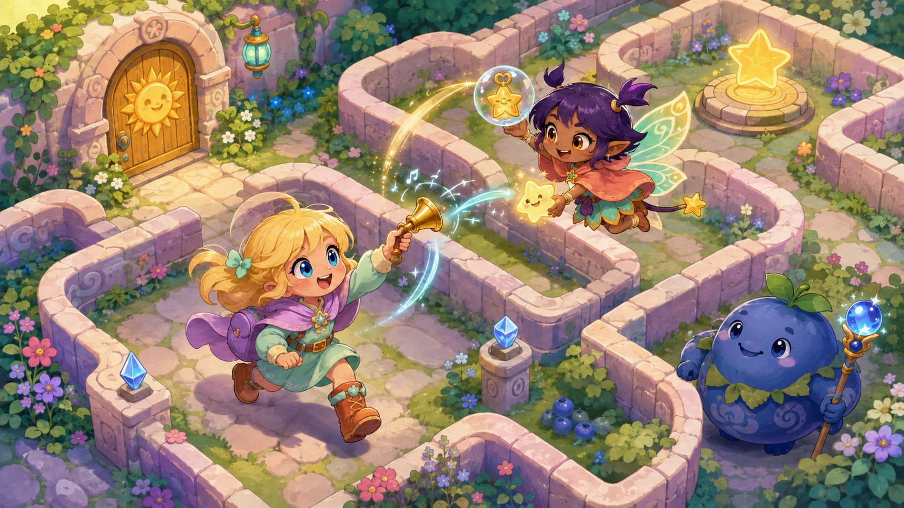
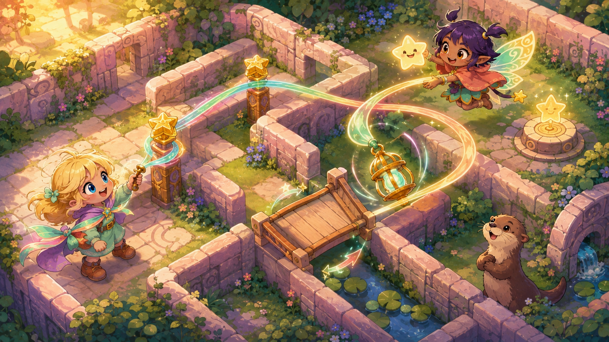
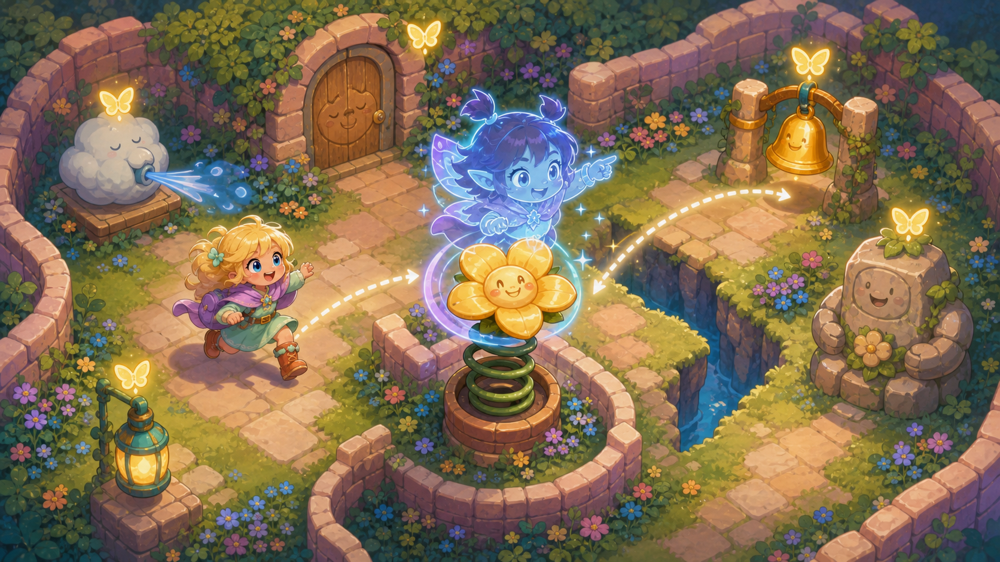
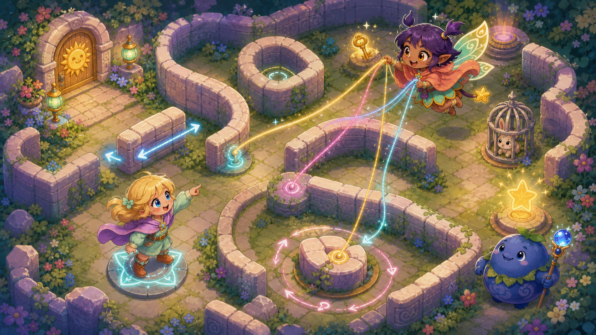
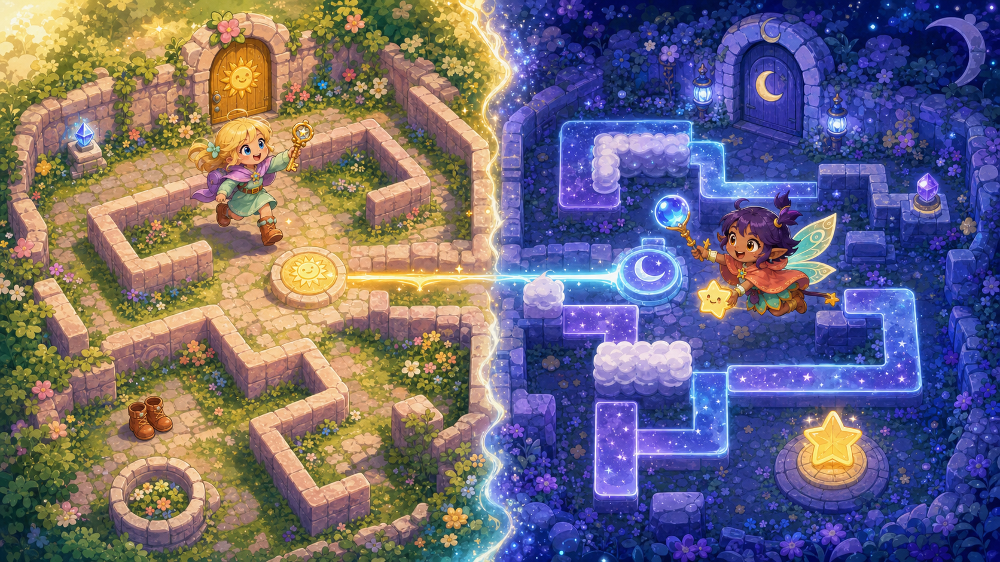
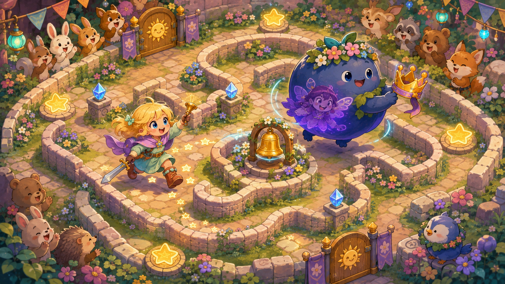

# Six better couch co-op pitches for Maze so Puzzle

> **Exploratory pitches and concept art — non-canon pending Amelia/Human approval.** This file does not replace the game vision, the detailed Plan 10 research, or Plans 01–09. It proposes six new directions after the previous shortlist failed to excite the Human. The art is mood-and-mechanic exploration, not approved character, level, UI, or production art.

## The creative reset

The first pitches were too frightened of touching the maze. They protected single-player integrity, but several of them gave Player 2 a harmless side activity while Ame continued playing the important game. That is safe parallel play, not the kind of couch co-op that creates stories a family repeats afterward.

The stronger thesis is: **Player 2 should own a consequential, shared, reversible piece of the current problem.** Sometimes P2 should be wonderfully helpful. Sometimes P2 should be able to start trouble on purpose. The trouble stays funny when Ame can see it coming, answer it, turn it into progress, and recover immediately. A prank that costs a few seconds can become a family joke; a prank that loses a key, ruins a Power sequence, or strands a run is simply grief.

These six are not renamed versions of Pocket Maplight, Co-Star Spark, Pass the Star, Sprig's garden activities, or a sparkle courier. The first pitch deliberately rebuilds the Human's flying-mischief idea into a fuller game. The other five change the relationship between the players: they share a physical ribbon, inhabit the world, reshape the labyrinth, occupy parallel realities, or play a friendly hero-versus-guardian ritual.

---

## Pitch 1 — Flicker's Prank Pact: Mischief Makes the Path

This is the Human's flying-character idea given real teeth. Player 2 is provisional **Flicker**, a tiny wish-imp who darts over walls inside Ame's view, fetches things, helps brilliantly, and occasionally behaves like an adorable pest. Ame still reads the maze, chooses the route, builds Power, and owns the camera. Flicker decides the social weather: rescue, tease, or start a clever situation they must finish together.

In ordinary mazes, Flicker can ferry optional treasure and anything Ame has already made safely reachable—but never steal a key from behind its own door, touch the exit, or skip a hazard lesson. She can deliver a pickup at once or play five seconds of giggling keep-away before it flies home; Ame's Bell ends the joke instantly. Duo play gets its own records because even safe delivery saves steps.

Helping earns **Whim**, which powers two tricks with double meanings. **Puff** spins Ame harmlessly for a laugh, but nudges her onto special co-op pads. **Bubble** plays keep-away with a permitted pickup, but protects a fragile light in dedicated **Prank Chambers**. Flicker starts trouble, Ame answers it, and together they turn the prank into progress—the exact warm-fuzzy rhythm the earlier helper pitches lacked.

**Honest trade-offs:** this is my strongest bet, but also the one most dependent on chemistry. The game must explain instantly what Flicker may carry, keep pranks brief and consensual, and make “enough now” effortless. If families laugh, counter-prank, and then ask each other for help, it works; if Ame spends the evening ringing the Bell, it does not.

---

## Pitch 2 — The Friendship Lasso: We are literally connected

At special Duo Stars, Ame and Flicker tie themselves together with a living ribbon of friendship magic. Ame controls the grounded end; Flicker controls the flying end. The ribbon curls around star-posts and maze corners, turning distance and angle into a shared puzzle drawn right across the board. When it works, both players can literally see that they did it together.

The pair loop distant bells, swing lanterns around walls, rotate bridges, catch floating parcels, and slingshot Ame across special Duo gaps. Flicker creates the line and tension, but Ame gives the final Tug before her feet leave the ground. Early rooms need one post and one pull; later **Ribbon Roads** ask Ame to navigate one side of the maze while Flicker weaves through its empty spaces.

The same ribbon is an affectionate nuisance. Flicker can wobble it, tie a ridiculous bow around Ame, tug her cape, or overshoot a bell; Ame can plant her feet, snap the bow back, or release instantly. Normal mazes use it only for optional curiosities, while dedicated co-op rooms turn that comic wobble into the move that saves the day.

**Honest trade-offs:** a bad tether can make each player feel that the other ruined the attempt. It needs generous snapping, a clear preview, instant untangling, and no fiddly realistic rope physics. The cheapest test is one lantern and two posts: if the pair immediately invent their own manoeuvre, this idea has magic.

---

## Pitch 3 — The Possession Playground: Player 2 becomes Puzzlewild

Flicker can fly, but her real power is diving into the maze's personality. She can become a spring-flower, sleepy door, cloud fan, lantern, carpet, or statue. Ame plays the route; Flicker plays the room. Every prop becomes a tiny comedy character Amelia might talk back to, and flying becomes the exciting dash between new bodies rather than empty pointer movement.

Every body offers a real choice. A spring chooses direction and charge; a fan chooses angle and strength; a lantern chooses which rune to illuminate; a carpet either slides along its lane or curls into a ramp. Ame must stand in the right place and prepare the next move while Flicker chooses which body to inhabit and how to operate it. Neither is simply pressing the other player's switch.

Mischief grows naturally from the characters: a door pretends to snore, a spring spins its arrow, or a carpet bumps Ame's boots and scuttles away. Ame's Bell pops Flicker back out, and every prop settles safely if the joke goes on too long. Ordinary mazes offer only optional talking toys; dedicated **Dollhouse Mazes** make a chain of possessions the real puzzle.

**Honest trade-offs:** this is secretly a lot of bespoke content. If the props are switches wearing faces, P2 will spot the trick immediately. Start with only spring, fan, and sleepy door; continue only if choosing a body and mastering its personality is fun before polished art and sound do the selling.

---

## Pitch 4 — The Living Labyrinth: Player 2 plays the maze

This pitch lets Player 2 play the maze itself. Ame remains the explorer; Flicker becomes an apprentice Maze Witch who tugs glowing ribbons attached to whole sections of labyrinth. She slides a wall, rotates a round room, swaps two corridor mouths, or grows a temporary hedge. Ame moves through the result and stands on Anchor Stars to lock in the pair's best ideas.

The loop practically writes the couch conversation: “Open the heart corridor.” “Not yet—I want the treasure.” “Fine, but I'm sending you through the flower detour.” Ame's position and discoveries decide which maze pieces wake up, so P2 cannot solve everything while P1 watches. One player changes the question; the other tests the answer.

This is safe trolling with the game's main pleasure still intact. Flicker can send Ame around a harmless scenic loop or reveal an audience of cheering animals, but Ame can lock the room and an **Unmix** pedestal restores it instantly. A dedicated **Living Labyrinths** book keeps keys, Boots, portals, Power, rescues, and treasure—then makes the route itself one player's instrument.

**Honest trade-offs:** this is a large co-op-only expansion, and P2 could easily become the real solver while Ame feels like a test piece. Ame must always choose when a layout becomes permanent, and every room needs a foolproof reset. If balanced, however, this may be the purest “Maze so Puzzle, but only friendship can solve it” idea here.

---

## Pitch 5 — Sunmaze / Moonmaze: The same place through two kinds of magic

Ame and Flicker stand in the same place but not the same truth. Ame walks the familiar **Sunmaze** of walls, keys, equipment, hazards, guardians, rescues, and Power. Flicker flies through the **Moonmaze**, where some walls become star roads and some open spaces become cloud barriers. The screen shows two interlocking versions of one magical place.

The players constantly hand the initiative back and forth. Ame opens a sunny window so Flicker can reach a moon switch; Flicker folds a cloud into a bridge; Ame wears the Boots to stand beneath a lunar prism; Flicker turns it toward Ame's next route. Keys and Power remain Ame's game, but P2 gets a genuine maze, position, and sequence of her own.

Moon magic still permits cheekiness: Flicker can close a gate too early, point a cloud path toward a silly constellation, or give Ame enormous sparkling eyebrows. Every real change has a nearby undo, so teasing becomes another thing to talk through rather than a deadlock. The best rooms naturally produce phrases like “My wall is your path,” “Step off the sun,” and finally, “Do it together.”

**Honest trade-offs:** this is the biggest content bet and should proudly be a **Two friends required** adventure, not awkwardly converted to solo. Its two worlds must remain readable without relying on colour, and leaving mid-room must be painless. In return, both players get an equally legitimate version of what makes Maze so Puzzle fun.

---

## Pitch 6 — The Polite Guardian Games: Player 2 hosts the challenge

The friendly guardians invite Ame to a festival—and Flicker gets to play them. In tiny one-camera trials, P2 possesses a guardian and becomes the cheerful host, obstacle, and comedian. Ame still finds the right weapon, builds Power, and reads the route. Flicker feints down lanes, blows harmless puffs, carries a ribbon crown, and tries to shepherd Ame toward optional prizes.

This is cooperative-versus, not ordinary PvP. Flicker receives three **Mischief Cards** for crowd-pleasing near misses and one **Friendship Card** for the finale. The pair earns full applause only if Ame finds the prize and the guardian performs three different tricks. Once Ame has legal Power and rings the challenge bell, the Polite Sword Rule guarantees the bow: P2 can make the journey theatrical, but never veto the ending.

The role invites performance. A parent can be an outrageously clumsy guardian; a child can cackle while hiding the crown, then proudly save the adult with the final card. Spectator animals cheer clever rallies rather than anyone's defeat. One-to-two-minute **Guardian Games** reset instantly and swap roles easily, making them the safest place to explore genuine trolling without imposing it on a story maze.

**Honest trade-offs:** this is the riskiest social pitch. Some families will adore the theatre; others will read any detour as antagonism. It needs mutual opt-in, a Helpful version, and strict anti-stalling. It may become a brilliant bonus festival rather than the main co-op mode—and that would still be a good outcome.

---

## My opinionated recommendation

The best product shape is not to choose between “flying helper in normal mazes” and “real co-op-only mazes.” Use both at different intensities:

1. Prototype **Flicker's Prank Pact** in one existing representative maze. Give her one solver-safe item carry, one useful/annoying Puff, the Bell counter, and no other powers.
2. Put one doorway in that prototype leading to a single-camera **Friendship Lasso** room. This tests whether the pair enjoy a shared object and a genuinely mandatory cooperative act.
3. If Amelia wants to inhabit everything, pursue **Possession Playground**. If she wants to command the puzzle, pursue **The Living Labyrinth**. If she wants secrets and communication, pursue **Sunmaze / Moonmaze**. If she wants to chase, tease, and perform, pursue **The Polite Guardian Games**.

That prototype asks the real question the previous pitches avoided: **is the magic in having a helpful second cursor, or in having a trusted little troublemaker whose actions Ame must answer?** My bet is the latter. The flying companion should be fun because she can start situations—not because she can vacuum up optional sparkles—and the deepest Duo mazes should turn that mischievous agency into something the two players could never do alone.

## How to pitch these to Amelia

Show the six pictures and titles first. Do not call one role easier, safer, or the helper. Ask only:

1. “Which character would you want to be?”
2. “What is the funniest thing you would do to the other player?”
3. “Which picture makes you want to grab a controller right now?”
4. “Which one sounds fun for a whole maze, and which sounds fun for only a little challenge room?”

Her invented verbs matter more than a numerical ranking. If she immediately explains a prank, counter-prank, or cooperative use that is not written here, that is probably the most valuable design result in this entire file.

## What the additional research changed

All sources below were accessed **2 September 2026**. These are precedent principles, not proof that a particular Maze so Puzzle idea will delight Amelia.

- Nintendo's *Super Mario Galaxy 2* Co-Star can collect and shoot Star Bits, stop some enemies, activate checkpoints, and grab coins. *New Super Mario Bros. U* Boost Mode lets another player place temporary blocks, halt mechanisms, and help or inconvenience the main players. The lesson is that an accessible helper can have genuine world authority; the danger is granting authority over Maze so Puzzle's critical route state. [Nintendo Galaxy 2 manual](https://csassets.nintendo.com/noaext/image/private/t_KA_PDF/Wii_Super_Mario_Galaxy2_Eng?_a=DATAg1AAZAA0), [Nintendo NSMBU manual](https://www.nintendo.com/eu/media/downloads/games_8/emanuals/wii_u_6/new_super_mario_bros__u_2/ElectronicManual_WiiU_NewSuperMarioBrosU_EN.pdf).
- *Sackboy: A Big Adventure* combines a solo-complete adventure, dedicated Teamwork Levels, physical moves that can help or annoy friends, affection emotes, shared rewards, and catch-up behavior. That supports normal mazes with a cheeky companion plus a separate Duo book where cooperation is mandatory. [PlayStation Blog](https://blog.playstation.com/2020/12/17/sackboy-a-big-adventure-update-adds-online-multiplayer-today/).
- *Snipperclips* turns cutting your partner into both the joke and the solution, then makes mistakes recoverable through restoration. The design inference is crucial: the prank verb should also be a useful co-op verb, with a fast and obvious undo. [Nintendo](https://www.nintendo.com/en-gb/Games/Nintendo-Switch-download-software/Snipperclips-Cut-it-out-together--1173331.html).
- *Luigi's Mansion 3* gives Gooigi a unique traversal domain, a clear weakness, solo role-switching, co-op control, and cheap resummoning. The companion feels legitimate because it can do things the hero cannot, not because it produces more particles. [Nintendo](https://luigismansion3.nintendo.com/gameplay/).
- *PHOGS!* and *Chariot* put both players in charge of one stretchy body or central object. Their strongest social property is shared culpability: when something beautiful or ridiculous happens, both players know they caused it. [PHOGS official site](https://playphogs.com/), [Chariot developer FAQ](https://chariotgame.com/faq/).
- *BOKURA* gives two players different versions of the same place; *It Takes Two* pairs connected abilities in two-player content; *PICO PARK* changes the multiplayer gimmick from level to level. Together they support a Duo shelf with its own grammar instead of weakening every solo maze. [Kodansha](https://creatorslab.kodansha.co.jp/en/products/1275/), [EA](https://www.ea.com/games/it-takes-two/it-takes-two/features), [PICO PARK](https://picoparkgame.com/pp1/).
- Research on co-located play found greater interdependence increased communication and reduced frustration, while shared control could reduce competence and autonomy. Asymmetric co-op research similarly linked designed dependence with connectedness. The implication is to give each player a different noun and verb over one shared problem—not split one avatar's steering wheel. [Emmerich & Masuch](https://doi.org/10.1145/3116595.3116606), [Harris & Hancock](https://doi.org/10.1145/3290605.3300239).
- Direct evidence for intentional trolling in young family pairs remains limited. “Positive trolling” is therefore a hypothesis to test with Amelia, not a label that makes obstruction safe by declaration.

## The Prank Pact shared by the mischievous pitches

The most adventurous pitches assume an explicit **Prank Pact** when P2 joins:

- **Helpful:** partner-targeted pranks become friendly visual reactions; all required co-op verbs remain.
- **Cheeky:** the intended default, with short, telegraphed inconvenience and immediate counterplay.
- **Wild:** available only after both players confirm it and only inside resettable Duo rooms.

No setting permits permanent item theft, lost Power, destroyed treasure, forced hazards, camera seizure, story dismissal, menu fighting, or a soft lock. Ame always has a one-button **Brace/Bell** response; only one prank can be active; repetition grants temporary immunity; and every prank must also have a productive use. If the affected player loses more than a couple of seconds, cannot answer back, or loses something earned, it is grief rather than mischief.

## Concept-art production note

The six images were generated with the built-in ImageGen workflow and copied into `docs/plans/assets/10-coop-better-pitches/`. They share one exploratory visual brief: an original warm children's storybook JRPG, readable top-down maze dioramas, tactile pastel paint, deep-plum outlines, Ame's blonde/blue/mint/lavender identity, and provisional Flicker as a warm-brown-skinned, violet-haired, golden-eyed wish-imp with mint-and-gold moth wings. Each prompt then focused on one mechanic: help-versus-prank magic, shared ribbon tension, friendly prop possession, movable labyrinth sections, linked sun/moon topology, or a ceremonial guardian chase. No generated design is approved canon.
