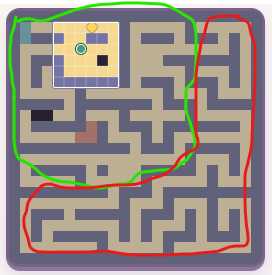

# Lanternlight: spatial variety, not a blanket small-map rule

Human clarification following the v0.22.2 playtest, 2026-09-06. This is a
paraphrased intake, not a solver result or completed redesign.

Original attached image preserved unchanged: 21,753 bytes, SHA-256
`f796172ec30ea9e71af8df455fea0697433dbd571c3a7db7af99e58df8dc1159`.
Green marks the preferred varied rooms, interesting spaces and connecting
corridors. Red marks the repetitive dense winding corridors.

The Human wants more open spaces, wider corridors, room relationships and
interesting spatial puzzles, with traditional dense mazes as exceptions that
offer an additional enjoyable twist. Large 20×20+ levels can be welcome if they
use that space well. Size itself is not the objection: long, bend-heavy,
low-interest traversal is. Discovery may come from seeing a goal in another
room, finding the door/route, teleporting and reasoning between rooms, rather
than simply following a long hidden winding corridor.

This supersedes interpreting the earlier “slightly smaller” request as an
across-the-board shrinking mandate or fixed quota of at most four >16-tile
levels. Preserve the current technical 24×24 ceiling unless separately reviewed;
this request does not require raising it. Plan09 must justify interest, visual
orientation, meaningful route choices, event gaps, revisits and solver cost,
including wider/open-space layouts. Do not mistake raw map area, added loot or
raw branch count for worthwhile puzzle challenge.

Owners: Plan09 authored/generated topology; PT06/PT12 pacing; PT15/Plan04
material scale. Performance qualification still applies to larger visible worlds.
